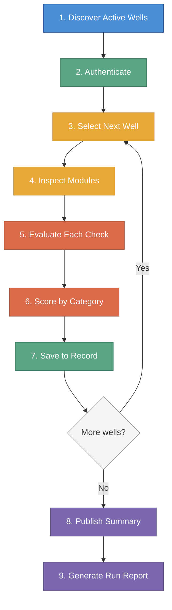

# How It Works

*Last updated: 2026-04-16*

The QC Automation Agent follows a structured sequence every time it runs. This page walks through that sequence step by step, from the moment a run is started to the moment scores appear on the QC tracking board.

---

## The Run Sequence

The diagram below shows the standard active-well run sequence. A [historical run mode](#historical-run-mode) using a different check set is also available for completed wells.

The agent loops through Steps 3 through 7 for each well before publishing results. All wells for a given operator are evaluated before the summary is written to the tracking board.

### Step 1: Discover Active Wells

Every run begins by querying the platform directly for active wells. The agent consults a configured operator list and asks the platform how many wells are currently active for each operator. It then retrieves the full list of those wells, including each well's name, location, and current status.

There is no manually maintained spreadsheet or input file. The discovery process runs automatically each time, ensuring the agent always works from the current set of active wells rather than a potentially stale list.

The agent can also be directed to evaluate a single specific well or to run against all operators in sequence.

### Step 2: Authenticate

The agent establishes a secure session with the cloud platform using stored credentials. This session is used for all subsequent data retrieval. Credentials are never written to logs or stored beyond the active session.

### Step 3: Select the Next Well

The agent takes the next well from the queue. This step also confirms the well's current status on the platform and checks that it matches the expected status for the type of run in progress.

### Step 4: Inspect Modules

For the selected well, the agent requests data from each module being checked. The modules cover bottom hole assembly records, directional surveys, real-time sensor connections, engineering plans, daily reports, and uploaded documents.

Data is retrieved through the platform's API. A rate limiter ensures the agent spaces its requests to avoid overloading the platform.

### Step 5: Evaluate Each Check

Each check applies a predefined rule to the retrieved data. The rules are deterministic -- the same data always produces the same result. There is no interpretation, scoring on a curve, or subjective judgment.

Each check produces one of five results:

| Result | Meaning |
|---|---|
| **YES** | The expected data is present and meets the criteria |
| **NO** | The expected data is missing or does not meet the criteria |
| **PARTIAL** | Some of the expected data is present, but not all |
| **N/A** | This check does not apply to this well |
| **INCONCLUSIVE** | The agent could not retrieve enough information to make a determination |

### Step 6: Score by Category

The checks are grouped into scoring categories. The agent calculates an average score for each category, then combines the category scores using a weighted formula to produce an overall quality score for the well. Categories that reflect more critical operational data carry higher weight.

See the [Scoring](scoring) page for the full breakdown of categories, weights, and scoring math.

### Step 7: Save to Record

After evaluating all checks for a well, the agent writes the per-well results to a database. This includes the check outcomes, category scores, well metadata (depth, spud date, status), and the overall quality score. This database record is the score of record for the well and is retained regardless of what happens in subsequent steps.

This write happens for every well, after every run. It cannot be skipped.

### Step 8: Publish Operator Summary

After all wells for an operator are processed, the agent publishes a summary row to the Monday.com QC tracking board. This row shows the operator's overall score, the number of wells evaluated, the date of the run, and a link to the operator's full results. One row per operator is maintained on the board, and each run overwrites the previous summary.

This step is skipped for historical runs (completed wells), for ad-hoc single-well evaluations, and when the publish flag is explicitly disabled.

### Step 9: Generate a Run Report

A detailed run report is saved locally as a structured file. This report includes every well checked, every check result, category breakdowns, and timing information. The report serves as an audit trail and a reference for investigating any unexpected scores.

For historical runs, the report is also exported as a spreadsheet with one row per well, showing scores across each category alongside well metadata.

---

## Historical Run Mode

The agent supports a separate run mode for evaluating completed wells -- those that have finished drilling and are no longer active. Completed wells have no live data streams, so several checks that depend on real-time feeds are not applicable.

In historical mode, the agent uses 13 checks grouped into three categories: BHA, Trajectory and Anti-Collision, and Supporting Data. The live data checks, tool inventory checks, and file drive checks are excluded. A location check (Check 30) that verifies the well's recorded surface coordinates is included in historical mode but not in standard active-well runs.

Results for historical runs are written to the same database record as active runs. The scoring uses the same 0.0 to 1.0 scale, with category weights adjusted to reflect what matters for completed wells.

See the [Scoring](scoring) page for the historical category weights.

---

## Guardrails

The agent operates with several built-in safety measures:

**Rate limiting.** Every request to the platform is spaced to avoid overloading the system. The agent is designed to be a respectful consumer of platform resources.

**Read-only access.** The agent never submits forms, saves records, deletes data, or modifies anything on the platform. It only reads.

**Credential protection.** Login credentials and session tokens are never written to log files or reports. A dedicated sanitizer scrubs sensitive values from all output before it is saved.

**Audit trail.** Every action the agent takes -- every data request, every evaluation result, every score published -- is recorded in a structured log. If a score is ever questioned, the full history of how it was determined can be reconstructed from the logs.

**Deterministic evaluation.** There is no randomness, no machine learning inference, and no subjective judgment in the scoring. The rules are fixed and transparent. The same well data will always produce the same score.

For a full description of each safety control, see the [Guardrails](guardrails) page.

---

*For definitions of terms used on this page, see the [Glossary](glossary). For the full list of checks, see [The 29 Checks](checks).*
