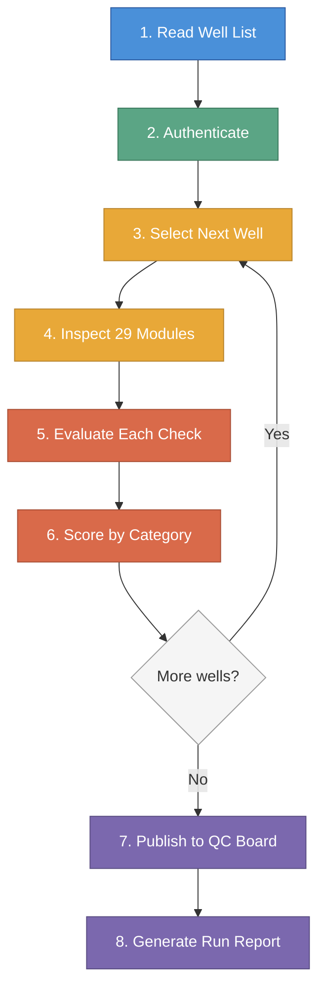

# How It Works

*Last updated: 2026-04-07*

The QC Automation Agent follows a structured sequence every time it runs. This page walks through that sequence step by step, from the moment a run is started to the moment scores appear on the QC tracking board.

---

## The Run Sequence

### Step 1: Read the Well List

Every run begins with an input file (a CSV spreadsheet) that lists the wells to check. Each row identifies a well by name, its operator (the company responsible), and the basin where it is located. The agent reads this file and builds a queue of wells to process.

The agent can be directed to check a single well, the first well in the list, or every well in the file.

### Step 2: Authenticate

The agent logs into the cloud platform using stored credentials. It establishes a secure session that will be used for all subsequent data retrieval. Credentials are never written to logs or stored beyond the active session.

### Step 3: Select the Next Well

The agent takes the next well from the queue and resolves it against the platform's well directory. This step confirms the well exists on the platform and retrieves the unique identifier needed to access its data.

### Step 4: Inspect 29 Modules

For the selected well, the agent requests data from each of the 29 modules being checked. These modules cover a range of drilling data categories: bottom hole assembly records, directional surveys, real-time sensor connections, engineering plans, daily reports, and uploaded documents.

The agent retrieves data through the platform's API, requesting the same information that would be displayed on each module's page. A rate limiter ensures the agent spaces its requests appropriately, never overwhelming the platform.

### Step 5: Evaluate Each Check

Each check applies a predefined rule to the retrieved data. The rules are deterministic -- the same data always produces the same result. There is no interpretation, scoring on a curve, or subjective judgment.

Each check produces one of five results:

| Result | Meaning |
|---|---|
| **YES** | The expected data is present and meets the criteria |
| **NO** | The expected data is missing or does not meet the criteria |
| **PARTIAL** | Some of the expected data is present, but not all |
| **N/A** | This check does not apply to this well |
| **INCONCLUSIVE** | The agent could not retrieve enough information to make a determination |

### Step 6: Score by Category

The 29 checks are grouped into 7 scoring categories (such as BHA, Trajectory, Live Data, and others). The agent calculates an average score for each category, then combines the category scores using a weighted formula to produce an overall quality score for the well. Categories that reflect more critical operational data carry higher weight.

See the [Scoring](scoring) page for the full breakdown of categories, weights, and scoring math.

### Step 7: Publish to the QC Board

After processing all wells for a given operator, the agent publishes the results to a Monday.com board. Each operator has a row on the board showing their overall QC score and the result of each individual check. The agent only updates scores that have changed since the last run, reducing unnecessary writes.

### Step 8: Generate a Run Report

A detailed run report is saved locally as a structured file. This report includes every well checked, every check result, category breakdowns, and timing information. The report serves as an audit trail and a reference for investigating any unexpected scores.

---

## Guardrails

The agent operates with several built-in safety measures:

**Rate limiting.** Every request to the platform is spaced to avoid overloading the system. The agent is designed to be a respectful consumer of platform resources.

**Read-only access.** The agent never submits forms, saves records, deletes data, or modifies anything on the platform. It only reads.

**Credential protection.** Login credentials and session tokens are never written to log files or reports. A dedicated sanitizer scrubs sensitive values from all output before it is saved.

**Audit trail.** Every action the agent takes -- every data request, every evaluation result, every score published -- is recorded in a structured log. If a score is ever questioned, the full history of how it was determined can be reconstructed from the logs.

**Deterministic evaluation.** There is no randomness, no machine learning inference, and no subjective judgment in the scoring. The rules are fixed and transparent. The same well data will always produce the same score.

For a full description of each safety control, see the [Guardrails](guardrails) page.
