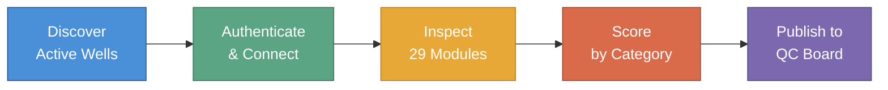

# QC Automation Agent

*Last updated: 2026-04-16*

The QC Automation Agent is a software system that automatically inspects drilling data quality across an entire portfolio of active and completed wells. It discovers wells directly from the platform, checks up to 29 data modules per well, computes weighted quality scores by operator, and publishes the results to a centralized tracking board. The agent replaces a manual inspection process that was time-consuming, inconsistent, and limited in how often it could run.

---

## Why It Exists

Drilling operations generate large volumes of data across dozens of platform modules -- assembly records, survey measurements, real-time sensor feeds, engineering plans, daily reports, and document uploads. Keeping that data complete and up to date is essential for operational safety, regulatory compliance, and decision-making.

Before automation, quality control was performed manually: a team member would open each well on the platform, navigate to each module, visually verify whether the expected data was present and current, and record the results. For a portfolio of approximately 115 active wells, this process took **6 to 7 hours per week** and could only be performed once per week at that pace.

The manual approach had three fundamental limitations:

1. **Speed** -- 29 checks across 115 wells is over 3,300 individual inspections per cycle
2. **Consistency** -- two reviewers checking the same well could reach different conclusions depending on interpretation and fatigue
3. **Frequency** -- weekly checks meant data quality issues could persist for days before being caught

## What the Agent Does

The agent performs the same 29 inspections, but it does so programmatically. It queries the platform to discover active wells automatically, authenticates with the cloud platform, retrieves data from each module through the platform's API, evaluates the data against a fixed set of rules, and publishes scores to a Monday.com board where account managers and leadership can review them. A separate historical mode evaluates completed wells using a tailored 13-check set.

Every check produces a clear result -- **YES** (data is present and correct), **NO** (data is missing or incorrect), **PARTIAL** (partially complete), **N/A** (not applicable to this well), or **INCONCLUSIVE** (the agent could not determine the answer). The same data always produces the same result.

## Quick Navigation

| I want to... | Start here |
|---|---|
| Understand the business case | [Background](background) |
| See how a run works step by step | [How It Works](how-it-works) |
| Know what gets checked | [The 29 Checks](checks) |
| Understand how scores are calculated | [Scoring](scoring) |
| See the impact numbers | [Results & Impact](results) |
| Check the project roadmap | [Roadmap](roadmap) |
| Look up a term | [Glossary](glossary) |
| See past QC trends | [QC Trend Board](trend-board) |

---

{: .note }
This wiki covers the Program Guide (what the agent does and why it matters). For technical contributors, a [Technical Reference](technical/) section covers architecture, code modules, and API details.
