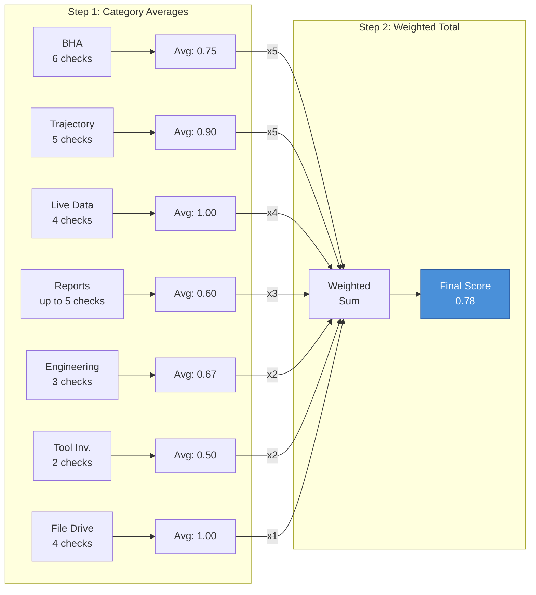

# Scoring

*Last updated: 2026-04-16*

The QC Automation Agent uses a two-step weighted scoring system to convert individual check results into a single quality score per operator. This page explains how that scoring works so anyone reviewing the QC board can interpret the numbers.

---

## How Check Results Become Numbers

Each of the 29 checks produces a result. These results map to numeric values:

| Result | Score | Meaning |
|---|---|---|
| **YES** | 1.0 | Data is present and meets the criteria |
| **PARTIAL** | 0.5 | Data is partially present or partially meets the criteria |
| **NO** | 0.0 | Data is missing or does not meet the criteria |
| **N/A** | Excluded | This check does not apply; it is removed from the calculation |
| **INCONCLUSIVE** | 0.0 | The agent could not determine the answer; scored as zero |

Checks marked N/A are excluded entirely -- they do not count against the operator. This prevents wells from being penalized for checks that genuinely do not apply to their situation.

---

## Step 1: Category Averages

The 29 checks are grouped into 7 categories. Within each category, the agent calculates the average score of all applicable checks.

**Example:** If the BHA category has 6 checks and one well's results are YES, YES, PARTIAL, YES, NO, YES, the category average is:

> (1.0 + 1.0 + 0.5 + 1.0 + 0.0 + 1.0) / 6 = **0.75**

If any check in the category returns N/A, it is simply excluded from the average. The denominator adjusts accordingly.

---

## Step 2: Weighted Total

Each category carries a weight reflecting its relative importance to overall data quality. The agent multiplies each category average by its weight, sums the results, and divides by the total weight to produce the final score.

### Category Weights

| Category | Weight | Rationale |
|---|---|---|
| **BHA** | 5 | Critical operational data. BHA records are essential for drilling optimization, failure analysis, and regulatory compliance. |
| **Trajectory and Anti-Collision** | 5 | Critical operational data. Survey and well plan data is fundamental to safe directional drilling. |
| **Live Data** | 4 | Real-time monitoring. Active data feeds provide immediate operational visibility. |
| **Drilling Reports** | 3 | Operational records. Daily reporting documents operations and supports post-well analysis. |
| **Engineering** | 2 | Planning documents. Engineering data is typically established before drilling and changes less frequently. |
| **Tool Inventory** | 2 | Asset tracking. Equipment records support logistics and tool management. |
| **File Drive** | 1 | Document storage. Supplementary uploads that back up structured platform data. |

**Total weight: 22**

---

## Worked Example

Consider a fictitious operator, "Example Energy," with one well called "EXAMPLE 1H." Here are the check results and how they produce a final score:

### Individual Check Results

| Category | Check | Result | Score |
|---|---|---|---|
| BHA | BHA Distribution | YES | 1.0 |
| BHA | BHA Comments | PARTIAL | 0.5 |
| BHA | BHA Uploads | YES | 1.0 |
| BHA | BHA Failure Reports | YES | 1.0 |
| BHA | BHA Component Completeness | YES | 1.0 |
| BHA | Post-Run BHA Grading | NO | 0.0 |
| Trajectory | Surveys | YES | 1.0 |
| Trajectory | Survey Program | YES | 1.0 |
| Trajectory | Survey Corrections | YES | 1.0 |
| Trajectory | EDM Files | YES | 1.0 |
| Trajectory | Well Plans | N/A | -- |
| Live Data | WITSML Connected | YES | 1.0 |
| Live Data | Live Geosteering | YES | 1.0 |
| Live Data | NPT Tracking | YES | 1.0 |
| Live Data | Cost Analysis | YES | 1.0 |
| Reports | Mud Report Distro | YES | 1.0 |
| Reports | Mud Program | N/A | -- |
| Reports | Formation Tops | NO | 0.0 |
| Reports | Drilling Program | YES | 1.0 |
| Reports | AFE Curves | NO | 0.0 |
| Engineering | Roadmaps | N/A | -- |
| Engineering | Wellbore Diagrams | YES | 1.0 |
| Engineering | Engineering Scenarios | NO | 0.0 |
| Tool Inventory | Rig Inventory Data | YES | 1.0 |
| Tool Inventory | Tool Catalog Data | NO | 0.0 |
| File Drive | File Drive: BHAs | YES | 1.0 |
| File Drive | File Drive: Well Plans | YES | 1.0 |
| File Drive | File Drive: Drill Prog | N/A | -- |
| File Drive | File Drive: Mud Reports | YES | 1.0 |

### Category Averages

| Category | Calculation | Average |
|---|---|---|
| BHA | (1.0 + 0.5 + 1.0 + 1.0 + 1.0 + 0.0) / 6 | 0.75 |
| Trajectory | (1.0 + 1.0 + 1.0 + 1.0) / 4 | 1.00 |
| Live Data | (1.0 + 1.0 + 1.0 + 1.0) / 4 | 1.00 |
| Reports | (1.0 + 0.0 + 1.0 + 0.0) / 4 | 0.50 |
| Engineering | (1.0 + 0.0) / 2 | 0.50 |
| Tool Inventory | (1.0 + 0.0) / 2 | 0.50 |
| File Drive | (1.0 + 1.0 + 1.0) / 3 | 1.00 |

Note: N/A results are excluded, so the denominator adjusts. Trajectory has 4 checks counted instead of 5 because Well Plans returned N/A.

### Weighted Total

| Category | Average | Weight | Contribution |
|---|---|---|---|
| BHA | 0.75 | 5 | 3.75 |
| Trajectory | 1.00 | 5 | 5.00 |
| Live Data | 1.00 | 4 | 4.00 |
| Reports | 0.50 | 3 | 1.50 |
| Engineering | 0.50 | 2 | 1.00 |
| Tool Inventory | 0.50 | 2 | 1.00 |
| File Drive | 1.00 | 1 | 1.00 |
| **Total** | | **22** | **17.25** |

**Final Score: 17.25 / 22 = 0.784 (78.4%)**

---

## Interpreting Scores

Scores range from 0.0 (no data present) to 1.0 (all applicable checks passed). As a general guide:

- **0.90 and above** -- Excellent. Nearly all data modules are complete and current. Minor gaps only.
- **0.70 to 0.89** -- Good, with room for improvement. Most critical data is present, but some modules need attention.
- **0.50 to 0.69** -- Needs attention. Significant gaps in data completeness, likely across multiple categories.
- **Below 0.50** -- Critical gaps. Major data modules are incomplete, affecting operational visibility.

These are general interpretations, not hard pass/fail thresholds. The appropriate standard may vary by operator, basin, or well phase.

---

## Reading the QC Board

The Monday.com QC board displays one summary row per operator with the following information:

- **Agent Score** -- The overall weighted score for the operator's most recent run (the number calculated above)
- **Well Count** -- The number of wells evaluated in that run
- **Last Run** -- The date the most recent score was published
- **Dashboard Link** -- A direct link to the operator's full results

Each run overwrites the operator's existing row with the latest score. Per-well check results are retained in the underlying database record for historical reference and trend analysis.

---

## Historical Mode Scoring

When the agent evaluates completed wells -- those that have finished drilling and are no longer active -- a different scoring configuration applies. Completed wells have no live data streams, so checks tied to real-time feeds are excluded. Three categories apply in historical mode:

| Category | Weight | Rationale |
|---|---|---|
| **BHA** | 5 | BHA records remain as important for completed wells as for active ones. |
| **Trajectory and Anti-Collision** | 5 | Survey data and surface location anchor the permanent directional record of the well. |
| **Supporting Data** | 3 | Mud reports, formation tops, and wellbore diagrams round out the historical record. |

Historical mode uses 13 checks across these three categories. Live data, tool inventory, file drive, and several other active-mode checks are excluded because they are not applicable to wells that have finished drilling. Check 30 (Location) -- which verifies the well's recorded surface coordinates -- is included in historical mode only.

Scores for completed wells follow the same numeric scale (0.0 to 1.0) and the same result types (YES, NO, PARTIAL, N/A, INCONCLUSIVE) as active well scoring.

---

*For definitions of scoring terms, see the [Glossary](glossary). For the full list of what gets checked, see [The 29 Checks](checks). For how scores translate to operational impact, see [Results & Impact](results).*
