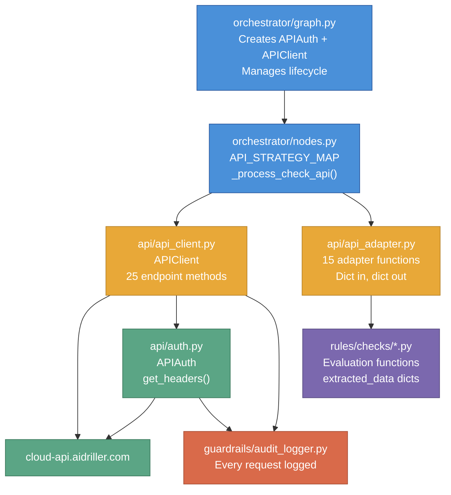

# API Layer

The API layer is the data retrieval engine for the QC Automation Agent. It is responsible for authenticating with the AI Driller Cloud platform, fetching well data across 25 endpoints, and translating raw JSON responses into the flat dictionaries the rule engine expects. For a non-technical explanation of what data the agent collects and why, see the [How It Works](../how-it-works) guide.

Last updated: 2026-04-10

---

## Purpose

The API layer was introduced in v0.6.0 to replace Playwright browser automation. The first production run (111 wells, 172 min) revealed that browser sessions degraded after ~45 minutes: stale DOM elements caused incorrect scores for every well processed after that threshold.

The layer is organized into three files with strict separation of concerns:

- **`src/api/auth.py`** -- JWT lifecycle only. Reads credentials, logs in, decodes token expiry, and refreshes transparently. No HTTP business logic.
- **`src/api/api_client.py`** -- HTTP execution engine only. Rate limiting, connection pooling, retry logic, and auth header injection. No data interpretation.
- **`src/api/api_adapter.py`** -- Pure translation only. Reshapes raw API JSON into the exact `extracted_data` dicts the rule engine evaluation functions expect. No network calls, no state.

This separation means auth bugs, rate-limit bugs, and data-shape bugs are isolated to one file each.

---

## How It Fits

The diagram below shows the data flow from the orchestrator through the API layer to the rule engine.



The diagram above shows: the orchestrator creates auth and client instances, nodes.py dispatches checks via `API_STRATEGY_MAP`, the client fetches data (through auth and rate limiter), adapters reshape the response, and the rule engine receives a flat dict it cannot distinguish from legacy browser extraction.

**Upstream callers:** `orchestrator/graph.py` (lifecycle), `orchestrator/nodes.py` (`_process_check_api`)

**Downstream consumers:** `rules/checks/*.py` evaluation functions via `extracted_data` dicts

---

## Design Decisions

### Decision 1: Option A (Adapter Pattern) over Option B (Rewrite Eval Functions)

**Decision:** Adapters in `api_adapter.py` reshape API JSON to match the existing evaluation function contracts. The 29 rule engine check files were not modified.

**Rationale:** Rewriting 29 evaluation functions to consume deeply-nested API JSON would have introduced regression risk across every check simultaneously. The adapter pattern isolated the migration to one file, left the rule engine untouched, and preserved the existing 400+ rule engine tests as a regression guard. The adapter output is indistinguishable from what `extractor.py` produced.

**Alternative rejected:** Option B (rewrite eval functions to consume API JSON directly). Still tracked in TASKS.md as a future improvement but deferred. The evaluation logic was correct; the data source was not. Changing both at once was too risky.

---

### Decision 2: Three-File Separation (auth, client, adapter)

**Decision:** Authentication, HTTP execution, and data translation each live in a separate file with no circular imports.

**Rationale:** A single "api.py" god file would have made testing harder (mocking auth for client tests, mocking the client for adapter tests) and would have coupled token-refresh logic to JSON-reshaping logic. The three-file structure means adapters are testable with zero mocks (pure functions, static fixtures), the client is testable by mocking only the httpx layer, and auth is testable by mocking only the network.

**Alternative rejected:** Single file with internal classes. Rejected because the test isolation benefit alone justified the split.

---

### Decision 3: Pure Functions for Adapters

**Decision:** Every function in `api_adapter.py` is a pure function: dict(s) in, dict out. No network calls, no class instances, no side effects except one `logger.warning` per unexpected input shape.

**Rationale:** Pure functions can be tested exhaustively with static JSON fixtures without any mocking. Every branch and edge case is testable synchronously. Adding state or network calls to adapters would require async fixtures and mock chain setup for every adapter test.

**Alternative rejected:** Adapter class with injected dependencies. Rejected because it added complexity without benefit -- adapters have no lifecycle, no shared state, and no reason to be instantiated.

---

### Decision 4: Single `_make_request` Choke Point

**Decision:** All 25 endpoint methods route through `APIClient._make_request()`. No endpoint method calls `self._client.request()` directly.

**Rationale:** Rate limiting, auth header injection, retry logic, and audit logging must apply to every outbound request without exception (Non-Negotiables #2 and #5). A single choke point makes this impossible to accidentally bypass. Adding a new endpoint method in the future only requires calling `_make_request` -- the safety guarantees are inherited automatically.

**Alternative rejected:** Each endpoint method managing its own rate limiting. Rejected because it would require 25 implementations of the same boilerplate, each a potential source of omission.

---

### Decision 5: Null vs. Empty Contract

**Decision:** Adapters return `None` for fields when the API response indicates the data could not be retrieved (missing key, `None` payload, unexpected response shape). They return `[]` or `False` when the API confirms the data exists but is empty.

**Rationale:** The rule engine evaluation functions treat these two states differently. `None` triggers `INCONCLUSIVE` (the agent could not determine the answer). An empty list or `False` triggers `NO` or `N_A` (the agent confirmed nothing is there). Conflating them would cause empty wells to score `INCONCLUSIVE` instead of `NO`, inflating scores.

**Alternative rejected:** Always returning a default value (`[]` or `False`) on any failure. Rejected because it masks extraction failures as legitimate empty checks.

---

### Decision 6: 1-Hour Token Expiry Buffer (`EXPIRY_BUFFER_SECONDS = 3600`)

**Decision:** The token is considered expired if it expires within 1 hour, not at the actual expiry time.

**Rationale:** A full operator cycle takes ~20 minutes. The buffer ensures a token acquired at the start of an operator is not mid-run expired 19 minutes in. The buffer is conservative but the cost of re-login is negligible (one POST request). A shorter buffer (e.g., 5 minutes) would still theoretically expire during a large run.

---

## Public Interface

### `auth.py` -- `APIAuth`

`APIAuth` manages the full JWT lifecycle for one agent run. The orchestrator creates one instance and passes it to `APIClient`. Callers use `get_headers()` exclusively -- they never call `login()` directly.

**Initialization:**

```python
auth = APIAuth(audit_logger, log_sanitizer)
```

Reads `ADC_USERNAME` and `ADC_PASSWORD` from `os.environ` at construction. Raises `ValueError` immediately if either is missing or empty. Credentials are stored only on the instance and never appear in logs.

---

| Method | Signature | What it does | When to call it | Errors |
|--------|-----------|-------------|----------------|--------|
| `login` | `async login() -> None` | POSTs credentials to `/api/auth/login`, stores the JWT, registers it with `LogSanitizer` | Called automatically by `get_headers()`; rarely called directly | `httpx.HTTPStatusError` on 401/403; `httpx.RequestError` on network failure; `ValueError` if response has no `token` field |
| `is_expired` | `is_expired() -> bool` | Local clock check against the JWT `exp` claim. No network call. | Called by `refresh_if_needed()` before every API call | Never raises; malformed token is treated as expired |
| `refresh_if_needed` | `async refresh_if_needed() -> None` | Calls `login()` only if `is_expired()` is True | Called internally by `get_headers()` | Same as `login()` |
| `get_headers` | `async get_headers() -> dict[str, str]` | Returns `{"Authorization": "<Bearer token>"}`, refreshing if needed. Concurrent callers share a single `asyncio.Lock`; only one refresh runs at a time, others wait then read the updated token. **This is the only method external callers should use.** | Called by `APIClient._make_request()` before every HTTP request | Same as `login()` if refresh is triggered |

**Internal: `_decode_jwt_exp()`**

Strips the `"Bearer "` prefix, splits the JWT on `"."`, base64url-decodes the middle segment (payload), and returns the integer `exp` claim. Raises `ValueError` on any malformed input. Called only by `is_expired()`. The `is_expired()` method catches `ValueError` and returns `True` (treats malformed token as expired, triggering re-login).

**Audit log events produced by auth.py:**

| Event | When |
|-------|------|
| `AUTH_LOGIN_STARTED` | At the top of `login()` |
| `AUTH_SUCCESS` | After token stored, includes `expires_in_hours` |
| `AUTH_FAILED` | On `httpx.HTTPStatusError`, includes `status_code` |
| `AUTH_NETWORK_ERROR` | On `httpx.RequestError`, includes `error_type` and `reason` |
| `AUTH_TOKEN_PARSE_ERROR` | When the login response has no `token` field |

---

### `api_client.py` -- `APIClient`

`APIClient` is a single-connection-pool HTTP client for the AI Driller Cloud API. It must be used as an async context manager per run. The connection pool opens in `__aenter__` and closes in `__aexit__`.

**Lifecycle:**

```python
async with APIClient(auth, rate_limiter, audit_logger) as client:
    result = await client.get_well_search()
    bha_list = await client.get_bha_list(uuid)
```

Never call endpoint methods outside the `async with` block -- `self._client` will be `None` and the call will raise `AttributeError`.

---

**`_make_request(method, endpoint, **kwargs) -> dict`**

The internal choke point. All 25 endpoint methods call this. Never called from outside the class.

Execution sequence on every call:
1. Call `self._auth.get_headers()` (transparently refreshes if needed)
2. Execute `self._client.request(method, endpoint, headers=..., **kwargs)`
3. On 4xx: log `API_REQUEST_FAILED` with `reason="client error"`, raise immediately (no retries)
4. On 5xx or `httpx.RequestError`: log `API_REQUEST_RETRY`, backoff via `self._rate_limiter.backoff_seconds(attempt)`, retry
5. On max retries exhausted: log `API_REQUEST_FAILED` with `reason="max retries exhausted"`, raise
6. On 2xx: log `API_REQUEST_SUCCESS`, return `response.json()`

The PLATFORM rate limit bucket was removed in v0.8.0. Concurrent API access is now controlled at the orchestrator level by a semaphore (`semaphore_size` in `config/agent.yaml`). `self._rate_limiter` is still injected and its retry configuration (`max_retries`, `backoff_seconds`) is used, but `acquire()` is no longer called on the API path. The MONDAY bucket remains active for Monday.com calls.

---

**Endpoint Methods -- Complete Reference**

All methods are `async`, accept `uuid: str` unless noted, and return `dict`. All raise `httpx.HTTPStatusError` on non-recoverable HTTP errors and `httpx.RequestError` on network failure after retries.

| Method | HTTP | URL | Extra params | Notes |
|--------|------|-----|------|-------|
| `get_well_search()` | POST | `/api/wells/search` | `json={}` | Returns 17k+ global wells. Read-only POST. No args. |
| `get_well_detail(uuid)` | GET | `/api/wells/{uuid}` | -- | Returns `end_depth`, `well_tz`, realtime flag |
| `get_bha_list(uuid)` | GET | `/api/wells/{uuid}/bha` | -- | Shared by checks 10, 11, 12, 13, 14, 15 |
| `get_bha_details(uuid, bha_id)` | GET | `/api/wells/{uuid}/bha/{bha_id}/current_version` | `params={"full": "true"}` | Returns components with grade_out; two args |
| `get_bha_files(bha_id)` | GET | `/api/bha/{bha_id}/files/list` | -- | Takes `bha_id` only, not `uuid` |
| `get_surveys(uuid)` | GET | `/api/wps/surveys` | `params={"type": "FACT", "well_id": uuid}` | Query params, not path segment |
| `get_file_drive_tree(uuid)` | GET | `/api/file_drive/{uuid}` | -- | Returns 2-level folder tree |
| `get_witsml_link(uuid)` | GET | `/api/integration/well_link/well/{uuid}` | -- | Returns bare dict (no `data` wrapper) |
| `get_survey_program(uuid)` | GET | `/api/wells/{uuid}/wps/survey_program` | `params={"type": "FACT"}` | |
| `get_geosteering(uuid)` | GET | `/api/geosteering/{uuid}/interpretation` | -- | |
| `get_npt_hazards(uuid)` | POST | `/api/wells/{uuid}/hazards/list` | `json={}` | Read-only POST; body required or returns 400 |
| `get_cost_analysis(uuid)` | GET | `/api/wells/{uuid}/costs` | `params={"well_stage": "DRILLING"}` | |
| `get_edm_history(uuid)` | GET | `/api/wells/{uuid}/edm_history` | -- | |
| `get_survey_plans(uuid)` | GET | `/api/wells/{uuid}/surveys/plans` | -- | Returns `variantType` enum values |
| `get_rig_inventory(uuid)` | GET | `/api/wells/{uuid}/bha/inventory` | -- | |
| `get_tool_catalog(uuid)` | GET | `/api/bha/catalog` | `params={"well_id": uuid}` | Query param only; no uuid path segment |
| `get_mud_reports(uuid)` | GET | `/api/well/{uuid}/mud` | -- | **Singular "well"** -- platform inconsistency, do not fix |
| `get_mud_program(uuid)` | GET | `/api/wells/{uuid}/mud_program` | -- | |
| `get_formation_tops(uuid)` | GET | `/api/wells/{uuid}/formations` | -- | |
| `get_roadmaps(uuid)` | GET | `/api/wells/{uuid}/roadmap/list` | -- | |
| `get_wellbore_designs(uuid)` | GET | `/api/wells/{uuid}/designs` | -- | Returns `design_type` (not `variantType`); has `_PLAN` suffix |
| `get_engineering_scenarios(uuid)` | GET | `/api/wells/{uuid}/engineering/scenarios` | -- | |
| `get_drilling_program(uuid)` | GET | `/api/wells/{uuid}/drill_prog` | -- | |
| `get_afe_curves(uuid)` | GET | `/api/wells/{uuid}/time_cost_estimate` | -- | |
| `get_well_detail(uuid)` | GET | `/api/wells/{uuid}` | -- | Also used by `adapt_surveys` for `end_depth` |

---

**Audit log events produced by api_client.py:**

| Event | When | Key fields |
|-------|------|-----------|
| `API_REQUEST_SUCCESS` | Every successful 2xx response | `endpoint`, `method`, `status_code` |
| `API_REQUEST_FAILED` | On 4xx or exhausted retries | `endpoint`, `method`, `status_code` or `error_type`, `reason` |
| `API_REQUEST_RETRY` | Before each retry attempt | `endpoint`, `method`, `attempt`, `error_type` |

---

### `api_adapter.py` -- Adapter Functions

All adapter functions are pure functions. Every function takes one or two dicts (or a dict and a list) and returns a dict. No network calls, no class instances. The return dict matches the contract expected by the corresponding evaluation function in `rules/checks/`.

**The null vs. empty rule (applies to every adapter):**

| Input condition | Return value | Rule engine result |
|-----------------|-------------|-------------------|
| `data` key missing or `None` | `None` for the critical field | `INCONCLUSIVE` |
| `data` key present but `[]` or `{}` with no content | `False` or `[]` | `NO` or `N_A` |
| `data` key present with content | `True` or populated list | `YES` or `PARTIAL` |

---

**Generic Adapter**

| Function | Checks | Signature | Returns | Edge cases |
|----------|--------|-----------|---------|-----------|
| `adapt_presence_check(api_response)` | 3, 6, 7, 8, 16, 17, 19, 20, 21, 23, 24, 25 | `dict -> dict` | `{"data_present": bool \| None}` | Dict-shaped `data` (e.g., survey_program): checks list-valued fields, because `bool(dict)` is always `True` even when all lists are empty. Scalar `data` logs a warning and falls through to `bool(data)`. |

**When NOT to use `adapt_presence_check`:** checks 1, 5, 9, 18, 22 all require richer field extraction and have dedicated adapters.

---

**Check-Specific Adapters**

| Function | Check(s) | Signature | Returns | Notable behavior |
|----------|----------|-----------|---------|-----------------|
| `adapt_witsml_status(api_response)` | 1 | `dict -> dict` | `{"header_timestamp": int \| None}` | Uses `realtime` boolean from the well detail response (already cached during well selection). `realtime=True` returns current epoch ms; `realtime=False` returns epoch 0. The broken `/api/integration/well_link` endpoint is not used. |
| `adapt_surveys(surveys_response, well_detail_response)` | 2 | `(dict, dict) -> dict` | `{"data_present": bool \| None, "point_source_desc": list[str], "last_md": str, "current_depth": str}` | Two-response adapter. Extracts last 5 `point_source_desc` values and last `md`. `current_depth` comes from well detail `end_depth`. |
| `adapt_survey_corrections(surveys_response)` | 4 | `dict -> dict` | `{"point_source_desc": list[str] \| None}` | Returns ALL point sources (not last 5). Eval filters for manual corrections. |
| `adapt_geosteering(api_response)` | 5 | `dict -> dict` | `{"button_text": str \| None}` | Synthesizes the legacy browser button label from `linked_interpretation_id` and `linked_interpretation_name`. If `linked_id` is not `None`, returns `"Connected to {name}"`. Otherwise `"Connect to Geosteering"`. Tech debt: ideally the eval would read structured fields directly. |
| `adapt_well_plans(api_response)` | 9 | `dict -> dict` | `{"data_present": bool \| None, "variant_types": list[str]}` | Maps `PRINCIPAL` -> `"Definitive"` via `_VARIANT_TYPE_MAP`. Eval checks for `"Definitive"` substring. Unrecognized enum values pass through unchanged. |
| `adapt_bha_grid(api_response)` | 10 | `dict -> dict` | `{"data_present": bool \| None, "bha_types": list[str]}` | API returns uppercase `"ACTUAL"`, `"PLANNED"`. Applies `str.capitalize()` to match legacy output (`"Actual"`, `"Planned"`). |
| `adapt_bha_drawer_data(bha_list_response, bha_files_list)` | 11, 12 | `(dict, list[dict]) -> dict` | `{"bha_comments": list[dict] \| None, "bha_upload_counts": list[int] \| None}` | Serves both check 11 (comments) and check 12 (upload counts) from one call, matching the legacy shared-strategy cache. Logs a warning if `bha_files_list` length does not match Actual BHA count. |
| `adapt_bha_failure_flags(api_response)` | 13 | `dict -> dict` | `{"has_failed_flags": list[bool] \| None}` | Reads `has_failed` from every BHA in the list. Empty list means no BHAs (not None). |
| `adapt_bha_components(bha_list_response, bha_details_list)` | 14 | `(dict, list[dict]) -> dict` | `{"component_types": list[str] \| None}` | Flattens `type_title` values from `common_props` across all Actual BHAs. Uses data envelope unwrap (`detail.get("data", detail)`). |
| `adapt_bha_grade_out(bha_list_response, bha_details_list)` | 15 | `(dict, list[dict]) -> dict` | `{"grade_out_fields": list[dict] \| None}` | Finds Bit components by `"Bit" in type_title`. Uses key path hunt for grade data. One dict per Actual BHA; `None` entry if `components` is absent. |
| `adapt_mud_distro(api_response)` | 18 | `dict -> dict` | `{"data_present": bool \| None, "last_modified": int \| None}` | Returns `max(updated_at)` across all reports as epoch ms integer. The eval function's `_parse_datetime` accepts epoch int/float at the top of its check chain. |
| `adapt_bha_uploads(bha_list_response, bha_files_list)` | 12 | `(dict, list[dict]) -> dict` | `{"bha_upload_counts": list[int] \| None}` | Standalone version of the upload count logic from `adapt_bha_drawer_data`. Used when check 12 is run without check 11. |
| `adapt_wellbore_designs(api_response)` | 22 | `dict -> dict` | `{"data_present": bool \| None, "design_types": list[str]}` | Uses `design_type` field (not `variantType`). Enum has `_PLAN` suffix (e.g., `"PROTOTYPE_PLAN"`). Maps any value starting with `"PRINCIPAL"` to `"Definitive"` via `startswith`, not exact match. |
| `adapt_file_drive(api_response, folder_name)` | 26, 27, 28, 29 | `(dict, str) -> dict` | `{"folder_has_files": bool \| None}` | Takes `folder_name` as a second arg (from YAML `extraction.params`). Walks a 2-level tree. Uses `modified_at is not None` as the file-presence signal (no file-level children in the tree response). Returns `None` (INCONCLUSIVE) if the folder is not found. |

---

## Internal Patterns

### Data Envelope Unwrap

Most API endpoints return `{"data": [...]}`. BHA detail responses return `{"data": {"components": [...]}}`. When consuming BHA details, adapters use:

```python
data_envelope = detail.get("data", detail)
components = data_envelope.get("components", [])
```

The `detail.get("data", detail)` fallback handles both wrapped and unwrapped shapes, making adapters tolerant of minor API shape variations without failing.

---

### Key Path Hunt (Grade-Out)

The `adapt_bha_grade_out` function illustrates the key path hunt pattern. The platform API stores grade data under `"grade_out"`, `"dull_grading"`, or `"grade_in"` depending on the version of the BHA record:

```python
grade_data = comp.get("grade_out")
if grade_data is None:
    grade_data = comp.get("dull_grading")
if grade_data is None:
    grade_data = comp.get("grade_in")
if grade_data is None:
    grade_data = {}
```

**Critical:** `is None` checks are used instead of `or` chains. An empty dict `{}` is falsy, so `comp.get("grade_out") or comp.get("dull_grading")` would skip a present-but-empty `grade_out` key and fall through to `dull_grading`, potentially picking up stale data. This was a live bug caught during development (2026-04-06).

---

### Variant Type Mapping

Two checks require converting API enum strings to the browser-era display strings the evaluation functions check for. This is handled by a module-level constant:

```python
_VARIANT_TYPE_MAP: dict[str, str] = {
    "PRINCIPAL": "Definitive",
}
```

- **`adapt_well_plans`**: uses `_VARIANT_TYPE_MAP.get(variantType, variantType)` -- exact match lookup. API returns `"PRINCIPAL"` or `"PROTOTYPE"`.
- **`adapt_wellbore_designs`**: uses `startswith("PRINCIPAL")` -- prefix match. API returns `"PRINCIPAL_PLAN"`, `"PROTOTYPE_PLAN"` (with `_PLAN` suffix). Verified live 2026-04-07.

---

### Dict-Shape Presence Detection (Survey Program)

The survey program endpoint returns a dict, not a list. `bool(dict)` is always `True` if any keys exist, even if all list-valued fields are empty. `adapt_presence_check` handles this:

```python
if isinstance(data, dict):
    for value in data.values():
        if isinstance(value, list) and value:
            return {"data_present": True}
    return {"data_present": False}
```

This walks the dict values looking for any non-empty list. If all lists are empty (or there are no list values), it returns `False`. This is edge case #9 from the migration plan.

---

### BHA Iteration Pattern

Checks 11, 12, 14, and 15 require fetching per-BHA detail or file data. The orchestrator's `_process_check_api` fetches the BHA list first, then iterates over `ACTUAL`-type BHAs to fetch per-BHA data. The adapter receives the full list response and the per-BHA responses as parallel lists:

```
bha_list_response = await client.get_bha_list(uuid)
bha_details_list = [await client.get_bha_details(uuid, bha["id"]) for bha in actual_bhas]
adapter_result = adapt_bha_components(bha_list_response, bha_details_list)
```

If `get_bha_list` was not already in `resource_cache` when a per-BHA check runs, the per-BHA loop never executes and the adapter receives an empty list, producing `[]` instead of `INCONCLUSIVE`. The `_build_check_queue` ordering runs `bha_grid` first to populate the cache, but `--checks` filters that skip `bha_grid` will hit this. See NOTES.md 2026-04-07.

---

## Platform API Gotchas

These are inconsistencies in the AI Driller Cloud API that differ from the standard patterns. Each one is handled in code and must not be "fixed" (the platform owns these shapes).

| Gotcha | Endpoint | Detail |
|--------|----------|--------|
| Singular "well" | `/api/well/{uuid}/mud` | Every other endpoint uses `"wells"` (plural). Using `"wells"` returns 404. |
| Query param UUID | `/api/bha/catalog?well_id={uuid}` | Only endpoint that passes the UUID as a query param instead of a path segment. |
| Read-only POST | `/api/wells/{uuid}/hazards/list` | Requires POST with `json={}`. Omitting the body returns 400. |
| Bare dict response | `/api/integration/well_link/well/{uuid}` | Returns a flat dict with no `"data"` wrapper, unlike every other endpoint. Do not use `adapt_presence_check` for this endpoint. |
| `design_type` vs `variantType` | `/api/wells/{uuid}/designs` | Wellbore designs uses `design_type` (not `variantType` like well plans). Enum values have `_PLAN` suffix. Verified 2026-04-07. |
| `linked_interpretation_id` type | `/api/geosteering/{uuid}/interpretation` | Is an integer (`46000`) for some operators and a UUID string for others. Use `is not None` check, not type comparison. |

---

## Non-Negotiable Enforcement

| # | Rule | How this module enforces it |
|---|------|-----------------------------|
| 1 | Client data safety | No cross-operator data in this layer. Each API call uses the specific well UUID. `resource_cache` is cleared between wells by the orchestrator. |
| 2 | Platform safety | All endpoint methods route through `_make_request`. All calls are GET or read-only POST. Concurrent access is controlled by a semaphore in the orchestrator (v0.8.0+); the PLATFORM rate bucket was removed. Retry backoff still uses `RateLimiter.backoff_seconds()`. |
| 3 | Accuracy | `adapt_*` functions enforce null vs. empty contract: `None` payload = INCONCLUSIVE path, empty data = NO path. No silent defaults. |
| 4 | Completeness | Every one of the 29 checks has an adapter path. Missing strategy entry in `API_STRATEGY_MAP` logs `API_FETCH_FAILURE` and returns `INCONCLUSIVE` -- it does not silently skip the check. |
| 5 | Transparency | Every request logged (`API_REQUEST_SUCCESS`, `API_REQUEST_FAILED`, `API_REQUEST_RETRY`). JWT registered with `LogSanitizer` immediately after login. Token never appears in audit logs. |

---

## Testing Strategy

**134 tests across 3 files.** Run with:

```bash
python -m pytest tests/api/ -v
```

---

### `tests/api/test_auth.py` -- 18 tests

**What is mocked:** `httpx.AsyncClient` (network), `os.environ` (credentials), `AuditLogger`, `LogSanitizer`.

**What is NOT mocked:** JWT decoding logic (pure math), `is_expired()` clock comparison.

**Coverage:**

| Scenario | Test(s) |
|----------|---------|
| Missing or empty credentials raise `ValueError` | `test_missing_username_raises`, `test_missing_password_raises`, `test_empty_username_raises` |
| Successful login stores token and registers with sanitizer | `test_login_posts_to_correct_url_and_stores_token` |
| HTTP 401 raises and logs `AUTH_FAILED` | `test_login_401_raises_and_logs` |
| Network error raises and logs `AUTH_NETWORK_ERROR` | `test_login_network_error_raises_and_logs` |
| Response with no `token` field raises `ValueError` and logs | `test_login_missing_token_in_response_raises` |
| `is_expired()` True when token expires within buffer | `test_is_expired_true_for_token_expiring_within_buffer` |
| `is_expired()` False when token has >1 hour remaining | `test_is_expired_false_for_token_expiring_in_two_days` |
| `is_expired()` True when no token | `test_is_expired_true_when_token_is_none` |
| `is_expired()` True for malformed token | `test_is_expired_true_for_malformed_token` |
| `get_headers()` triggers login when no token | `test_get_headers_triggers_login_when_no_token` |
| `get_headers()` returns correct dict | `test_get_headers_returns_authorization_dict` |

**Helper:** `_make_jwt(exp)` builds a real base64url-encoded JWT payload for expiry testing without hitting the network.

---

### `tests/api/test_api_client.py` -- 42 tests

**What is mocked:** `httpx.AsyncClient.request`, `APIAuth.get_headers`, `RateLimiter.acquire`.

**What is NOT mocked:** `_make_request` flow logic, retry counter, error classification.

**Coverage:**

| Scenario | Test(s) |
|----------|---------|
| Context manager opens and closes httpx pool | `test_context_manager_opens_and_closes_client` |
| Successful request returns JSON, logs SUCCESS, acquires rate limit | `test_make_request_success_returns_json_and_logs` |
| 4xx fails immediately, no retries, logs FAILED | `test_make_request_4xx_fails_fast_no_retries` |
| 5xx retries then succeeds | `test_make_request_5xx_retries_then_succeeds` |
| Network timeout exhausts all retries, logs FAILED | `test_make_request_exhausts_retries_on_network_error` |
| Auth headers merged into every request | `test_make_request_merges_auth_headers` |
| All 25 endpoint methods use correct URL and method | One test per endpoint method |

**Pattern:** Endpoint method tests use `patch.object(client, "_make_request")` to verify URL construction and HTTP method selection without exercising retry logic.

---

### `tests/api/test_api_adapter.py` -- 74 tests

**What is mocked:** Nothing. All tests use static JSON fixtures.

**Coverage:** Every adapter function is tested for:

- Valid data (happy path)
- `data` key missing (should return `None` for critical fields)
- `data` key explicitly `None`
- `data` key present but empty (`[]` or `{}`)
- Edge cases specific to the adapter (e.g., dict-shaped data for `adapt_presence_check`, length mismatch for `adapt_bha_drawer_data`, key path hunt fallbacks for `adapt_bha_grade_out`)

**Coverage gaps:**

- No integration test against the live API (by design; the first production run is the integration test)
- `adapt_wellbore_designs` tested with `PROTOTYPE_PLAN` but `"Definitive"` mapping for `PRINCIPAL_PLAN` has not been observed in a live response -- the PRINCIPAL -> Definitive mapping is verified against the `startswith` logic only
- `adapt_geosteering` linked_interpretation_id integer-vs-UUID shape not explicitly tested (both pass the `is not None` check)
