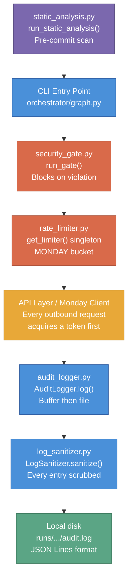

# Guardrails

The guardrails system is the security and observability foundation of the QC Automation Agent. It ensures every run is safe, auditable, and impossible to misconfigure in ways that could harm the platform, leak credentials, or produce silent incorrect results. For a non-technical overview of how the agent operates, see the [How It Works](../how-it-works) guide.

Last updated: 2026-04-10

---

## Purpose

The guardrails system is a five-file layer that runs cross-cutting enforcement across the entire agent lifecycle. It is not a single module but a coordinated set of independent components, each owning a distinct protection concern:

- **`src/guardrails/security_gate.py`** -- Blocks execution before any network activity if any security policy check fails.
- **`src/guardrails/rate_limiter.py`** -- Enforces minimum delay floors and per-minute ceilings on all outbound requests.
- **`src/guardrails/audit_logger.py`** -- Writes every agent action to a structured JSON Lines audit trail on local disk.
- **`src/guardrails/log_sanitizer.py`** -- Scrubs credential values from every audit entry before it reaches disk.
- **`src/guardrails/static_analysis.py`** -- Scans the codebase for security policy violations before every commit.

No guardrail is optional. All five enforce at least one of the [five non-negotiables](#non-negotiable-enforcement).

---

## How It Fits

The diagram below shows where each guardrail file intercepts the agent's execution flow.



**Execution order:** `static_analysis.py` runs before commit (offline). At runtime: `security_gate.py` runs first, blocking any run that fails policy. `rate_limiter.py` sits in front of every outbound request. `audit_logger.py` records every action. `log_sanitizer.py` scrubs every entry before it touches disk.

**Upstream callers:** `orchestrator/graph.py` calls `run_gate()` at startup and constructs `AuditLogger`. `api/api_client.py` and `reporter/monday_client.py` call `get_limiter().acquire()` before every request. `audit_logger.py` calls `log_sanitizer.sanitize()` on every `log()` call.

---

## Design Decisions

### Startup gate: block before any run vs. warn at runtime

| | |
|---|---|
| **Decision** | `run_gate()` raises `SecurityPolicyViolation` immediately on any failed check. The agent does not start. No partial runs. No overrides. |
| **Rationale** | LangGraph's tracing integration sends data to LangSmith by default. The network policy allows exactly three domains; LangSmith is not one of them. A passive warning is insufficient because warnings get ignored under time pressure. The gate must be active and must block execution, not advise. (ADR-QC-001, Decision 1) |
| **Alternative rejected** | Passive warnings only -- rejected because warnings get ignored and the policy would have no teeth. |

### Singleton rate limiter with hard floors

| | |
|---|---|
| **Decision** | `get_limiter()` returns a process-level singleton. Hard floors and ceilings are enforced in `RateLimitConfig.__post_init__` and cannot be overridden by configuration values below the floor. |
| **Rationale** | AI Driller Cloud is a production SaaS shared with real users. Floors prevent accidental misconfiguration from causing platform harm. The singleton pattern ensures no code path bypasses the limiter by constructing its own instance. (ADR-QC-001, Decision 2) |
| **Alternative rejected** | Per-request `sleep()` calls -- rejected because they are not centrally auditable and can be bypassed by any caller that forgets to call them. Fully configurable floors -- rejected because config files get edited and the floors are policy, not preference. |

### Buffer-then-file audit logger lifecycle

| | |
|---|---|
| **Decision** | `AuditLogger` buffers events in memory until `set_output_dir()` is called, then flushes to disk. Events logged before a run directory is known are never lost. |
| **Rationale** | Early lifecycle events (agent startup, security gate result) fire before the orchestrator has selected the first operator and determined the output path. Buffering ensures they appear in the audit file. The buffer flush happens in order at `set_output_dir()` time. |
| **Alternative rejected** | Discarding pre-run events -- rejected because it creates invisible gaps in the audit trail at exactly the time when startup failures are most likely to occur. |

### Log sanitizer as defense-in-depth

| | |
|---|---|
| **Decision** | `LogSanitizer` reads credential values from the environment at construction time and replaces any occurrence in any log entry dict before it is written. JWT tokens are registered at runtime via `add_secret()`. |
| **Rationale** | Even if a credential leaks into a log field by accident (e.g., an error message includes the raw URL with embedded credentials), the sanitizer catches it as the last step before disk. This is defense-in-depth: credentials should not reach the logger, but if they do, they are scrubbed. |
| **Alternative rejected** | Trusting callers to never log credentials -- rejected because error paths are the most likely place for credentials to appear in messages, and those paths are the hardest to audit manually. |

### Static analysis as pre-commit scanner

| | |
|---|---|
| **Decision** | `static_analysis.py` uses regex pattern matching against raw source text. It scans `.py` and `.yaml` files across `src/`, `tests/`, and `config/`. It does not use the Python AST. |
| **Rationale** | The checks being performed (credential string patterns, import names, URLs, gitignore entries, absolute paths) are all detectable from raw text without parsing the AST. Regex is simpler, requires no imports beyond the standard library, and has no dependency on Python version-specific AST structure. |
| **Alternative rejected** | AST inspection -- rejected because the checks do not require understanding Python semantics, and AST parsing adds complexity and potential failure modes for syntactically incomplete files. |

---

## File-by-File Reference

### `src/guardrails/security_gate.py`

**What it owns:** Startup policy verification. Runs six checks in order before any network activity. If any check fails, raises `SecurityPolicyViolation` and logs all failures. The agent does not start.

**Checks executed (in order):**
1. `LANGCHAIN_TRACING_V2` is unset or `"false"` (case-insensitive)
2. `LANGCHAIN_API_KEY` is not set
3. `ADC_USERNAME`, `ADC_PASSWORD`, and `MONDAY_API_TOKEN` are present and non-empty
4. `.env` exists on disk and `".env"` appears (non-commented) in `.gitignore`
5. `runs/` appears in `.gitignore` (directory is created if absent)
6. None of the blocked telemetry vars are set (`SENTRY_DSN`, `DD_API_KEY`, `DATADOG_API_KEY`, `NEW_RELIC_LICENSE_KEY`, `HONEYCOMB_API_KEY`, `LANGCHAIN_API_KEY`)

**Public interface:**

```python
def run_gate(
    project_root: Path | None = None,
    required_credentials: tuple[str, ...] = REQUIRED_CREDENTIALS,
    blocked_telemetry_vars: tuple[str, ...] = BLOCKED_TELEMETRY_VARS,
) -> GateResult
```
- `project_root`: Repo root for filesystem checks. Auto-detected by walking up from the module file if `None`.
- Returns `GateResult` with `.passed` bool and `.checks` list of `CheckResult` instances.
- Raises `SecurityPolicyViolation` (subclass of `RuntimeError`) if any check fails. All failures are logged before raising.

**Result types:**

```python
@dataclass
class CheckResult:
    name: str     # e.g. "langsmith_tracing_disabled"
    passed: bool
    detail: str   # Human-readable, includes "SECURITY_POLICY_VIOLATION:" prefix on failure

@dataclass
class GateResult:
    passed: bool
    checks: list[CheckResult]

    @property
    def failures(self) -> list[CheckResult]: ...
```

**Internal patterns:** Each of the six checks is a private function (`_check_langsmith_tracing_disabled`, etc.) that returns a `CheckResult`. `run_gate()` calls them all, collects results, logs each one, and raises only if any failed. This means all failures are visible in a single run, not just the first one.

**ADR reference:** ADR-QC-001, Decision 1.

---

### `src/guardrails/rate_limiter.py`

**What it owns:** Token bucket rate limiting for all outbound network requests. Singleton lifecycle. Exponential backoff calculation for retries.

**`BucketType` enum:**

```python
class BucketType(str, Enum):
    MONDAY = "monday"       # GraphQL calls to api.monday.com
```

The `PLATFORM` bucket was removed in v0.8.0. API call concurrency is now managed by a semaphore in the orchestrator (`semaphore_size` in `config/agent.yaml`). The MONDAY bucket remains for all Monday.com GraphQL calls.

**`RateLimitConfig` dataclass** (with enforced floors and ceilings):

| Parameter | Default | Floor | Ceiling | Notes |
|---|---|---|---|---|
| `min_page_delay_seconds` | 1.5s | 0.3s | -- | Unused since v0.8.0 (PLATFORM bucket removed). Field retained for config compatibility; no runtime consumer. |
| `max_pages_per_minute` | 15 | -- | 20 | |
| `cooldown_between_operators_seconds` | 10s | 5s | -- | |
| `retry_backoff_initial_seconds` | 5s | 5s | -- | |
| `retry_backoff_max_seconds` | 120s | -- | -- | |
| `max_retries_per_action` | 5 | -- | 10 | |
| `monday_calls_per_minute` | 10 | -- | 30 | |

Floor enforcement happens in `__post_init__` and logs a `rate_limiter.floor_enforced` warning if a value was clamped.

**`RateLimiter` public interface:**

```python
async def acquire(self, bucket: BucketType, context: str = "") -> None
```
Waits until a token is available in the specified bucket, then grants it. Always logs `rate_limiter.waiting` (if a wait occurred) and `rate_limiter.granted`. Never silently drops a request.

```python
async def operator_cooldown(self) -> None
```
Pauses for `cooldown_between_operators_seconds` between operator cycles. Always logged.

```python
def backoff_seconds(self, attempt: int) -> float
```
Returns `min(initial * 2^attempt, max)`. `attempt=0` returns the initial backoff. Used by `api_client.py` retry logic.

```python
@property
def max_retries(self) -> int
```
Returns `config.max_retries_per_action`.

**Singleton functions:**

```python
def get_limiter(config: RateLimitConfig | None = None) -> RateLimiter
```
Returns the process-level singleton. `config` is required only on the first call; subsequent calls ignore it.

```python
def reset_limiter() -> None
```
Resets the singleton to `None`. For testing only.

**Internal pattern:** `_TokenBucket` tracks a list of grant timestamps and a `_last_grant` timestamp. `seconds_until_available()` computes the maximum of two waits: the per-minute window wait (if the bucket is full) and the minimum-interval wait (if not enough time has elapsed since the last grant). Expired grants (older than 60 seconds) are purged before each check.

**ADR reference:** ADR-QC-001, Decision 2.

---

### `src/guardrails/audit_logger.py`

**What it owns:** Structured audit trail. Buffer-then-file lifecycle. Operator isolation guard. Well context injection. Flush-on-every-write.

**Lifecycle:**
1. `AuditLogger()` -- constructed at agent startup. Events go to buffer.
2. `set_output_dir(path)` -- opens `path/audit.log`, flushes buffer in order.
3. `log(event, **data)` -- writes directly to the open file.
4. `clear_output()` -- closes file, returns to buffer mode (called between operators).
5. `close()` -- final shutdown. Warns via structlog if buffer events were never written.

**Public interface:**

```python
def __init__(self, sanitizer: LogSanitizer | None = None) -> None
```
Constructs with an optional injected `LogSanitizer`. If `None`, a default `LogSanitizer()` is constructed. Injecting a mock sanitizer is the standard test pattern.

```python
def log(self, event: str, **data: object) -> None
```
Records one audit event. Builds `{"timestamp": ..., "event": ..., **well_context, **data}`, sanitizes it, then writes to disk or buffer. Explicit `**data` keys override `_well_context` if they share a key.

```python
def set_output_dir(self, output_dir: Path) -> None
```
Creates `output_dir` if needed, opens `output_dir/audit.log` in append mode, flushes the buffer. Raises `RuntimeError` if a file is already open -- the orchestrator must call `clear_output()` between operators. This is the client data safety guard (Non-Negotiable #1).

```python
def clear_output(self) -> None
```
Closes the file and returns to buffer mode. Safe to call defensively when no file is open.

```python
def set_well_context(self, well_name: str, well_uuid: str | None = None) -> None
```
Sets context that is merged into every subsequent `log()` entry. Called after `WELL_STARTED` so all events during well processing carry the well identity without every caller passing it explicitly.

```python
def clear_well_context(self) -> None
```
Clears well context between wells. Called after `WELL_COMPLETED`.

```python
def close(self) -> None
```
Closes any open file. If buffer contains unwritten events (never had `set_output_dir()` called), emits a `structlog.warning` with the count. This is the only place `audit_logger.py` uses structlog directly.

**File format:** JSON Lines (`audit.log`). One JSON object per line. Every entry has `"timestamp"` (ISO 8601 UTC, `Z` suffix) and `"event"`. Well context fields (`well_name`, `well_uuid`) appear when set. Arbitrary `**data` keys follow.

**Flush behavior:** `_write()` calls `self._file.flush()` after every `json.dumps()` write. Events are on disk immediately, not batched. A crash cannot lose events that were logged.

---

### `src/guardrails/log_sanitizer.py`

**What it owns:** Credential scrubbing for audit log entries. Defense-in-depth layer between `AuditLogger.log()` and disk.

**Constants:**
- `CREDENTIAL_VAR_NAMES`: `("ADC_USERNAME", "ADC_PASSWORD", "MONDAY_API_TOKEN")` -- matched against `config/agent.yaml security.required_credential_vars`.
- `REDACTED = "[REDACTED]"` -- replacement string for any matched secret value.

**Public interface:**

```python
def __init__(self) -> None
```
Reads credential values from `os.environ` at construction time. Only non-empty values are stored. If no credentials are set (e.g., in tests), `sanitize()` becomes a zero-cost passthrough.

```python
def add_secret(self, secret: str) -> None
```
Registers an additional secret for scrubbing at runtime. Used by `src/api/auth.py` to register the JWT token immediately after login, so it never appears in audit logs. Empty strings and duplicates are ignored silently.

```python
def sanitize(self, entry: dict) -> dict
```
Returns a new dict with all secret values replaced by `[REDACTED]`. Deep-walks the input recursively: handles nested dicts and lists. Non-string values (int, float, bool, None) pass through unchanged. Never raises -- on unexpected error, returns the entry unchanged and logs a `log_sanitizer.scrub_failed` warning via structlog. The input dict is never mutated.

**Internal pattern:** `_scrub(value)` dispatches on type. Strings are processed with `str.replace(secret, REDACTED)` for each registered secret. Dicts and lists are walked recursively. All other types are returned unchanged. The `sanitize()` wrapper catches any exception and falls back to the original entry to ensure audit logging never fails due to the sanitizer.

---

### `src/guardrails/static_analysis.py`

**What it owns:** Pre-commit security policy scan. Six independent checks against source files, config files, and repo metadata.

**`ALLOWED_DOMAINS`:** A hardcoded set of three approved domains -- the platform browser UI, the platform REST API, and the Monday.com GraphQL endpoint. Any URL outside this set fails the scan with a Zero Tolerance violation.

**The six checks:**

| Check | Function | What it scans | What it catches |
|---|---|---|---|
| 1 | `check_credential_patterns(root_dir)` | `src/`, `tests/` `.py` files | String literals matching credential patterns (32+ char alphanumeric, Bearer tokens, Stripe-style keys), `keyword = "literal_value"` patterns for password/token/secret/api_key |
| 2 | `check_disallowed_imports(root_dir)` | `src/`, `tests/` `.py` files | `import sentry_sdk`, `import datadog`, `import langsmith`, `import langchain` (but not `langgraph`) |
| 3 | `check_url_allowlist(root_dir)` | `src/`, `tests/` `.py` and `config/` `.yaml` files | URLs not matching `ALLOWED_DOMAINS` or `SAFE_URL_PATTERNS` (localhost, example.com, docs URLs, etc.) |
| 4 | `check_gitignore_compliance(root_dir)` | `.gitignore` | Missing required entries: `.env`, `runs/`, `screenshots/`, `__pycache__/`, `*.pyc` |
| 5 | `check_env_example(root_dir)` | `.env.example` | Values that look like real credentials (long mixed-case alphanumeric, known key prefixes) |
| 6 | `check_absolute_paths(root_dir)` | `src/` `.py` files only | String literals containing absolute path prefixes (`/home/`, `/Users/`, `C:\`, etc.) |

**Runner:**

```python
def run_static_analysis(root_dir: str = ".") -> bool
```
Runs all six checks, prints formatted pass/fail results, returns `True` if zero violations, `False` otherwise.

**How to run:**

```bash
python src/guardrails/static_analysis.py
```

Or from Python:

```python
from src.guardrails.static_analysis import run_static_analysis
passed = run_static_analysis(".")  # returns True on clean pass
```

**What constitutes a violation:** Any item in the list returned by an individual check function. Each violation is a dict with `"file"`, `"line"`, and `"message"` keys. The runner exits with code `1` if any violations are found.

**Known limitation:** The absolute path check uses a heuristic docstring tracker (toggle on triple-quote lines). It can mistrack multi-line string assignments that use triple quotes. This is documented in the source and is acceptable because absolute paths do not appear in docstrings in this codebase.

**Self-exclusion:** `test_static_analysis.py` is excluded from all scans because it contains intentional violation examples inside `_write_file()` string arguments as test fixtures.

---

## Non-Negotiable Enforcement

| Non-Negotiable | Enforcing File(s) | Mechanism |
|---|---|---|
| **#1 Client data safety** -- outputs strictly scoped to single operator | `audit_logger.py` | `set_output_dir()` raises `RuntimeError` if a file is already open. Orchestrator must call `clear_output()` between operators. Silent auto-close is explicitly refused. |
| **#2 Platform safety** -- read-only, minimum delay between requests | `rate_limiter.py` | Hard floor on `min_page_delay_seconds` (0.3s for API, previously 1.5s for browser). Singleton ensures all callers share the same bucket. `acquire()` always waits. |
| **#3 Accuracy** -- deterministic, ambiguity returns INCONCLUSIVE | `security_gate.py` | Startup gate blocks runs where credentials are missing or telemetry is enabled. Prevents runs that could produce unreliable or unauditable results. |
| **#4 Completeness** -- no silent omissions | `audit_logger.py`, `static_analysis.py` | Every action logged. `close()` warns if buffered events were never written. Static analysis catches code patterns that could introduce silent failures. |
| **#5 Transparency** -- every action logged | `audit_logger.py`, `log_sanitizer.py` | JSON Lines audit trail, one file per operator cycle. `log_sanitizer.py` scrubs credentials so logging can be unconditional without leaking secrets. |

---

## Testing Strategy

**Test count (as of 2026-04-07):** 627 total passing. Guardrails tests span 6 files.

### `tests/guardrails/test_security_gate.py`

**What is tested:** Every individual check function has a passing case and at least one failing case. `run_gate()` integration test verifies all checks pass together, raises `SecurityPolicyViolation` on first failure, and reports all failures in a single raise (not just the first one).

**Mocking strategy:** `monkeypatch` for environment variables. `tmp_path` for filesystem isolation (`.env`, `.gitignore`, `runs/` directory creation).

**Coverage:** All six checks covered. Edge cases include: `LANGCHAIN_TRACING_V2=FALSE` (uppercase) passes; `LANGCHAIN_TRACING_V2=1` fails; whitespace-only credentials fail; commented `.env` in `.gitignore` does not count; `runs` (without trailing slash) in `.gitignore` is accepted.

### `tests/guardrails/test_rate_limiter.py`

**What is tested:** Config floor and ceiling enforcement. `_TokenBucket` min-interval enforcement, per-minute window limit, expired grant purging. `RateLimiter.backoff_seconds()` initial, doubling, and max cap. `acquire()` with no wait and with required wait. Singleton identity (`get_limiter()` returns the same instance).

**Mocking strategy:** `time.monotonic` is monkeypatched to a controllable clock so tests run without real sleeps. `asyncio.sleep` is patched with `AsyncMock` or a side-effect function that advances the fake clock.

**Coverage:** Floors for `min_page_delay_seconds` (0.3s), `cooldown_between_operators_seconds` (5s), `retry_backoff_initial_seconds` (5s). Ceilings for `max_pages_per_minute` (20), `max_retries_per_action` (10), `monday_calls_per_minute` (30). `autouse` fixture resets the singleton before and after each test.

### `tests/guardrails/test_audit_logger.py`

**What is tested:** Buffer behavior before `set_output_dir()` is called. Buffer flush order on `set_output_dir()`. File creation. Operator isolation guard (raises on double `set_output_dir()`). Direct-to-disk writes after `set_output_dir()`. JSON format and required fields. Flush-on-every-write (file readable after each `log()` call). `clear_output()` returns to buffer mode. `close()` warns on unwritten buffer events. Sanitizer called on every entry. Well context injection and clearing. Context does not leak across operator cycles. Explicit `**data` overrides context.

**Mocking strategy:** `mock_sanitizer` fixture provides a `MagicMock` with `sanitize` passing entries through unchanged. `tmp_path` for filesystem isolation. `patch("src.guardrails.audit_logger.log")` for structlog warning assertion.

**Coverage gap:** The logger's behavior when `self._file.write()` raises an `OSError` (e.g., disk full) is not tested. This would cause an unhandled exception propagating to the caller.

### `tests/guardrails/test_log_sanitizer.py`

**What is tested:** String field redaction. Credential embedded in a longer string (partial replacement). Multiple credentials in one entry. Nested dict scrubbing. List scrubbing. Non-string values pass through unchanged. No-op passthrough when no secrets are set. Input dict immutability. `add_secret()` registers new values. `add_secret("")` ignored. `add_secret()` deduplication. No raise on unexpected types in the dict.

**Mocking strategy:** `patch.dict("os.environ", ...)` to inject fake credential values. `sanitizer_no_secrets` fixture uses `clear=True` to ensure a clean environment.

**Coverage:** All three credential variable names covered. Recursive walk covers two levels of nesting and list elements.

### `tests/guardrails/test_audit_logger_sanitizer_integration.py`

**What is tested:** End-to-end credential scrubbing from `AuditLogger.log()` through a real `LogSanitizer` to a file on disk. Verifies the raw credential value does not appear anywhere in the file content and the field contains `[REDACTED]`.

**Mocking strategy:** `patch.dict("os.environ", ...)` for the fake password. Real `LogSanitizer` (not mocked). Real file I/O via `tmp_path`.

### `tests/guardrails/test_static_analysis.py`

**What is tested:** Each of the six check functions has tests for detecting a violation and allowing a clean file. Tests use `tmp_path` with synthesized source files written via a `_write_file()` helper. `run_static_analysis()` is tested end-to-end against a clean minimal repo.

**Mocking strategy:** No mocks. Tests write real files to `tmp_path` and call the check functions directly.

**How to run the full guardrail test suite:**

```bash
python -m pytest tests/guardrails/ -v
```

**How to run static analysis:**

```bash
python src/guardrails/static_analysis.py
```
