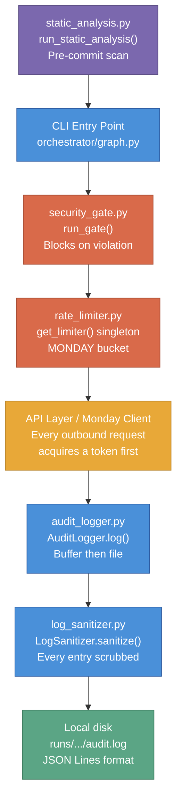
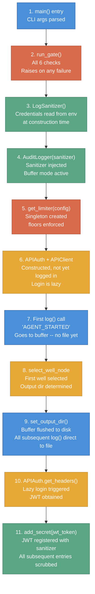

# Guardrails

*Last updated: 2026-04-12*

The guardrails system is the security and observability foundation of the QC Automation Agent. It ensures every run is safe, auditable, and impossible to misconfigure in ways that could harm the platform, leak credentials, or produce silent incorrect results. For the non-technical overview, see the [Guardrails](../guardrails) guide.

---

## Purpose

The guardrails system is a five-file layer that runs cross-cutting enforcement across the entire agent lifecycle. It is not a single module but a coordinated set of independent components, each owning a distinct protection concern:

- **`src/guardrails/security_gate.py`** -- Blocks execution before any network activity if any security policy check fails.
- **`src/guardrails/rate_limiter.py`** -- Enforces minimum delay floors and per-minute ceilings on all outbound requests.
- **`src/guardrails/audit_logger.py`** -- Writes every agent action to a structured JSON Lines audit trail on local disk.
- **`src/guardrails/log_sanitizer.py`** -- Scrubs credential values from every audit entry before it reaches disk.
- **`src/guardrails/static_analysis.py`** -- Scans the codebase for security policy violations before every commit.

No guardrail is optional. All five enforce at least one of the [five non-negotiables](#non-negotiable-enforcement).

---

## How It Fits

The diagram below shows where each guardrail file intercepts the agent's execution flow.



**Execution order:** `static_analysis.py` runs before commit (offline). At runtime: `security_gate.py` runs first, blocking any run that fails policy. `rate_limiter.py` sits in front of every outbound request. `audit_logger.py` records every action. `log_sanitizer.py` scrubs every entry before it touches disk.

**Upstream callers:** `orchestrator/graph.py` calls `run_gate()` at startup and constructs `AuditLogger`. `reporter/monday_client.py` calls `get_limiter().acquire()` before every GraphQL mutation. `audit_logger.py` calls `log_sanitizer.sanitize()` on every `log()` call.

---

## Agent Initialization Sequence

The guardrail components do not activate all at once. Each is constructed or called at a specific point in the startup sequence. Understanding this order explains how early events are captured and how the JWT registration window works.



**Key timing points:**

- Steps 1-6 are synchronous and happen before any `await`. If `run_gate()` fails, nothing else runs.
- Steps 7-9: `AGENT_STARTED` and any events during well queue loading go to the buffer. The first `log()` call that can reach disk is step 9's flush.
- Steps 10-11: The JWT token is not known until the first `get_headers()` call. `add_secret()` at step 11 closes the window where a JWT could theoretically appear in a log entry unscrubbed.
- If `set_output_dir()` is never called (e.g., `run_gate()` raises), the buffer is never flushed. `close()` warns about the stranded events.

---

## Design Decisions

### Startup gate: block before any run vs. warn at runtime

| | |
|---|---|
| **Decision** | `run_gate()` raises `SecurityPolicyViolation` immediately on any failed check. The agent does not start. No partial runs. No overrides. |
| **Rationale** | The underlying orchestration framework's tracing integration sends data to an external service by default. The network policy allows exactly three domains; that service is not one of them. A passive warning is insufficient because warnings get ignored under time pressure. The gate must be active and must block execution, not advise. (ADR-QC-001, Decision 1) |
| **Alternative rejected** | Passive warnings only -- rejected because warnings get ignored and the policy would have no teeth. |

### Singleton rate limiter with hard floors

| | |
|---|---|
| **Decision** | `get_limiter()` returns a process-level singleton. Hard floors and ceilings are enforced in `RateLimitConfig.__post_init__` and cannot be overridden by configuration values below the floor. |
| **Rationale** | The data platform is a production SaaS shared with real users. Floors prevent accidental misconfiguration from causing platform harm. The singleton pattern ensures no code path bypasses the limiter by constructing its own instance. (ADR-QC-001, Decision 2) |
| **Alternative rejected** | Per-request `sleep()` calls -- rejected because they are not centrally auditable and can be bypassed by any caller that forgets to include them. Fully configurable floors -- rejected because config files get edited and the floors are policy, not preference. |

### Buffer-then-file audit logger lifecycle

| | |
|---|---|
| **Decision** | `AuditLogger` buffers events in memory until `set_output_dir()` is called, then flushes to disk. Events logged before a run directory is known are never lost. |
| **Rationale** | Early lifecycle events (agent startup, security gate result) fire before the orchestrator has selected the first operator and determined the output path. Buffering ensures they appear in the audit file. The buffer flush happens in order at `set_output_dir()` time. |
| **Alternative rejected** | Discarding pre-run events -- rejected because it creates invisible gaps in the audit trail at exactly the time when startup failures are most likely to occur. |

### Log sanitizer as defense-in-depth

| | |
|---|---|
| **Decision** | `LogSanitizer` reads credential values from the environment at construction time and replaces any occurrence in any log entry dict before it is written. JWT tokens are registered at runtime via `add_secret()`. |
| **Rationale** | Even if a credential leaks into a log field by accident (e.g., an error message includes the raw URL with embedded credentials), the sanitizer catches it as the last step before disk. This is defense-in-depth: credentials should not reach the logger, but if they do, they are scrubbed. |
| **Alternative rejected** | Trusting callers to never log credentials -- rejected because error paths are the most likely place for credentials to appear in messages, and those paths are the hardest to audit manually. |

### Static analysis as pre-commit scanner

| | |
|---|---|
| **Decision** | `static_analysis.py` uses regex pattern matching against raw source text. It scans `.py` and `.yaml` files across `src/`, `tests/`, and `config/`. It does not use the Python AST. |
| **Rationale** | The checks being performed (credential string patterns, import names, URLs, gitignore entries, absolute paths) are all detectable from raw text without parsing the AST. Regex is simpler, requires no imports beyond the standard library, and has no dependency on Python version-specific AST structure. |
| **Alternative rejected** | AST inspection -- rejected because the checks do not require understanding Python semantics, and AST parsing adds complexity and potential failure modes for syntactically incomplete files. |

---

## File-by-File Reference

### `src/guardrails/security_gate.py`

**What it owns:** Startup policy verification. Runs six checks in order before any network activity. If any check fails, raises `SecurityPolicyViolation` and logs all failures. The agent does not start.

**Check ordering rationale:** The six checks run in a deliberate sequence. Framework tracing checks come first (checks 1 and 2) because an active tracing integration would immediately begin capturing all subsequent operations, including authentication. Disabling it before any auth attempt ensures that if the gate ultimately passes, the auth operations were never traced. Credential presence (check 3) comes next because the remaining checks (filesystem safety) are only meaningful if a run could actually proceed. The gitignore checks (4-6) are the last line of defense against accidental secret exposure via version control.

**Checks executed (in order):**
1. `LANGCHAIN_TRACING_V2` is unset or `"false"` (case-insensitive) -- blocks framework tracing
2. `LANGCHAIN_API_KEY` is not set -- blocks the tracing key independently of the tracing flag
3. `ADC_USERNAME`, `ADC_PASSWORD`, and `MONDAY_API_TOKEN` are present and non-empty
4. `.env` exists on disk and `".env"` appears (non-commented) in `.gitignore`
5. `runs/` appears in `.gitignore` (directory is created if absent) -- protects run output from accidental commit
6. None of the blocked telemetry vars are set (`SENTRY_DSN`, `DD_API_KEY`, `DATADOG_API_KEY`, `NEW_RELIC_LICENSE_KEY`, `HONEYCOMB_API_KEY`, `LANGCHAIN_API_KEY`)

**All-failures collection pattern:** `run_gate()` does not stop at the first failed check. It calls all six private check functions, collects every `CheckResult`, then raises `SecurityPolicyViolation` if the set contains any failures. The `GateResult.failures` property returns the subset of `CheckResult` instances where `passed=False`. This means a machine with three misconfigurations reveals all three in one output rather than requiring three sequential fix-and-retry cycles.

**Public interface:**

```python
def run_gate(
    project_root: Path | None = None,
    required_credentials: tuple[str, ...] = REQUIRED_CREDENTIALS,
    blocked_telemetry_vars: tuple[str, ...] = BLOCKED_TELEMETRY_VARS,
) -> GateResult
```
- `project_root`: Repo root for filesystem checks. Auto-detected by walking up from the module file if `None` -- looks for a `.git` directory.
- Returns `GateResult` with `.passed` bool and `.checks` list of `CheckResult` instances.
- Raises `SecurityPolicyViolation` (subclass of `RuntimeError`) if any check fails. All failures are logged before raising.

**Result types:**

```python
@dataclass
class CheckResult:
    name: str     # e.g. "langsmith_tracing_disabled"
    passed: bool
    detail: str   # Human-readable, includes "SECURITY_POLICY_VIOLATION:" prefix on failure

@dataclass
class GateResult:
    passed: bool
    checks: list[CheckResult]

    @property
    def failures(self) -> list[CheckResult]: ...
```

**ADR reference:** ADR-QC-001, Decision 1.

---

### `src/guardrails/rate_limiter.py`

**What it owns:** Token bucket rate limiting for all outbound network requests. Singleton lifecycle. Exponential backoff calculation for retries.

**`BucketType` enum:**

```python
class BucketType(str, Enum):
    MONDAY = "monday"       # GraphQL calls to api.monday.com
```

The `PLATFORM` bucket was removed in v0.8.0. API call concurrency is now managed by a semaphore in the orchestrator (`semaphore_size` in `config/agent.yaml`). The MONDAY bucket remains for all Monday.com GraphQL calls.

**`RateLimitConfig` dataclass** (with enforced floors and ceilings):

| Parameter | Default | Floor | Ceiling | Notes |
|---|---|---|---|---|
| `cooldown_between_operators_seconds` | 10s | 5s | -- | |
| `retry_backoff_initial_seconds` | 5s | 5s | -- | |
| `retry_backoff_max_seconds` | 120s | -- | -- | |
| `max_retries_per_action` | 5 | -- | 10 | |
| `monday_calls_per_minute` | 10 | -- | 30 | |

Floor and ceiling enforcement happens in `__post_init__`. When a value is clamped, `structlog` emits a `rate_limiter.ceiling_enforced` warning that includes the parameter name, the requested value, and the enforced value. This makes misconfigured values visible in the structlog output at startup.

**Token bucket algorithm:**

The `_TokenBucket` class maintains a sliding window over grant timestamps. The dual-wait computation in `seconds_until_available()` enforces both rate constraints simultaneously:

```python
def seconds_until_available(self) -> float:
    self._purge_old_grants()          # remove timestamps older than 60s
    now = time.monotonic()

    # Constraint 1: per-minute ceiling
    # If the bucket is full (grants this minute == max_per_minute),
    # the oldest grant expires at oldest_grant + 60.0
    if len(self._grants) >= self.max_per_minute:
        oldest = self._grants[0]
        window_wait = 60.0 - (now - oldest)
    else:
        window_wait = 0.0

    # Constraint 2: minimum interval between consecutive grants
    interval_wait = self.min_interval_seconds - (now - self._last_grant)

    # The request must satisfy both constraints; wait for whichever is longer
    return max(window_wait, interval_wait, 0.0)
```

`grant()` records the current monotonic timestamp in both `_grants` (the window list) and `_last_grant`. The `acquire()` flow:

1. Call `seconds_until_available()`
2. If wait > 0: log `rate_limiter.waiting` with `seconds`, `bucket`, and `context`; `await asyncio.sleep(seconds)`
3. Call `grant()` (re-purges and records timestamp)
4. Log `rate_limiter.granted`

**Why `time.monotonic()` over `time.time()`:** Wall clock time can jump backward during NTP synchronization. A backward jump would produce a negative `(now - self._last_grant)` value, making `interval_wait` positive when it should be zero, and causing the bucket to think no time has passed since the last grant. `time.monotonic()` is guaranteed never to decrease, making all interval calculations safe.

**Concurrency note:** `asyncio` runs a single-threaded event loop. The only yield point in `acquire()` is `await asyncio.sleep(seconds)`. From `seconds_until_available()` through `grant()`, no `await` occurs, so no other coroutine can interleave. The acquire-and-grant sequence is effectively atomic within the event loop.

**`RateLimiter` public interface:**

```python
async def acquire(self, bucket: BucketType, context: str = "") -> None
```
Waits until a token is available in the specified bucket, then grants it. Always logs `rate_limiter.waiting` (if a wait occurred) and `rate_limiter.granted`. Never silently drops a request.

```python
async def operator_cooldown(self) -> None
```
Pauses for `cooldown_between_operators_seconds` between operator cycles. Always logged.

```python
def backoff_seconds(self, attempt: int) -> float
```
Returns `min(initial * 2^attempt, max)`. `attempt=0` returns the initial backoff. Used by `api_client.py` retry logic.

```python
@property
def max_retries(self) -> int
```
Returns `config.max_retries_per_action`.

**Singleton functions:**

```python
def get_limiter(config: RateLimitConfig | None = None) -> RateLimiter
```
Returns the process-level singleton. `config` is required only on the first call; subsequent calls ignore it. This design ensures that all callers -- wherever they are in the call stack -- share one set of grant timestamps. A second `RateLimiter` instance would have no knowledge of grants from the first.

```python
def reset_limiter() -> None
```
Resets the singleton to `None`. For testing only.

**ADR reference:** ADR-QC-001, Decision 2.

---

### `src/guardrails/audit_logger.py`

**What it owns:** Structured audit trail. Buffer-then-file lifecycle. Operator isolation guard. Well context injection. Flush-on-every-write.

**Lifecycle:**
1. `AuditLogger()` -- constructed at agent startup. Events go to buffer.
2. `set_output_dir(path)` -- opens `path/audit.log`, flushes buffer in order.
3. `log(event, **data)` -- writes directly to the open file.
4. `clear_output()` -- closes file, returns to buffer mode (called between operators).
5. `close()` -- final shutdown. Warns via structlog if buffer events were never written.

**Log entry format:**

Every entry is a single JSON object on one line (JSON Lines format). The mandatory fields appear first, followed by well context when set, followed by the caller-supplied `**data` keys:

```json
{
  "timestamp": "2026-04-12T14:32:07.421Z",
  "event": "CHECK_COMPLETED",
  "well_name": "Sample Well 1H",
  "well_uuid": "00000000-0000-0000-0000-000000000001",
  "check_id": 3,
  "check_name": "surveys",
  "status": "YES",
  "score": 1.0,
  "elapsed_ms": 142
}
```

`timestamp` is always ISO 8601 UTC with a `Z` suffix, generated at the moment `log()` is called. `event` is the string identifier passed by the caller (e.g., `"CHECK_COMPLETED"`, `"RATE_LIMITER_WAITING"`, `"WELL_STARTED"`). All other fields are caller-supplied `**data`. Well context fields (`well_name`, `well_uuid`) are injected automatically when set via `set_well_context()`.

**Buffer behavior during startup:**

Before `set_output_dir()` is called, `_file` is `None` and `log()` appends each entry dict to `_buffer`. When `set_output_dir()` is called, it:
1. Creates `output_dir` if it does not exist
2. Opens `output_dir/audit.log` in append mode
3. Iterates over `_buffer` in order, writing each entry
4. Clears `_buffer`
5. Sets the mode to direct-to-file for all subsequent `log()` calls

If `set_output_dir()` is never called (e.g., the run was blocked by `run_gate()` raising), the buffer holds all startup events. `close()` will emit a `structlog.warning` with the count of unwritten entries. Those entries are lost. This is acceptable: if the agent never starts, there is no run directory to write them to, and the security gate result is visible in the terminal output.

**Operator isolation guard:**

`set_output_dir()` raises `RuntimeError` if `_file` is already open. This prevents the orchestrator from accidentally opening a second operator's log file while the first operator's file is still active. The orchestrator must call `clear_output()` after finishing each operator cycle before it can call `set_output_dir()` for the next one. Silent auto-close was explicitly rejected: a silent transition would make it possible to write one operator's events into another's file in any code path that fails to close properly.

**Flush-on-every-write:**

`_write()` calls `self._file.flush()` after every `json.dumps()` + write. OS buffering is bypassed. An event is on disk at the moment `log()` returns. A process crash cannot lose events that were logged before the crash. This adds a small per-event I/O cost that is acceptable at the agent's scale (~29 checks per well, ~150 wells per run).

**Public interface:**

```python
def __init__(self, sanitizer: LogSanitizer | None = None) -> None
```
Constructs with an optional injected `LogSanitizer`. If `None`, a default `LogSanitizer()` is constructed. Injecting a mock sanitizer is the standard test pattern.

```python
def log(self, event: str, **data: object) -> None
```
Records one audit event. Builds `{"timestamp": ..., "event": ..., **well_context, **data}`, sanitizes it, then writes to disk or buffer. Explicit `**data` keys override `_well_context` if they share a key.

```python
def set_output_dir(self, output_dir: Path) -> None
```
Creates `output_dir` if needed, opens `output_dir/audit.log` in append mode, flushes the buffer. Raises `RuntimeError` if a file is already open.

```python
def clear_output(self) -> None
```
Closes the file and returns to buffer mode. Safe to call defensively when no file is open.

```python
def set_well_context(self, well_name: str, well_uuid: str | None = None) -> None
```
Sets context that is merged into every subsequent `log()` entry. Called after `WELL_STARTED` so all events during well processing carry the well identity without every caller passing it explicitly.

```python
def clear_well_context(self) -> None
```
Clears well context between wells. Called after `WELL_COMPLETED`.

```python
def close(self) -> None
```
Closes any open file. If buffer contains unwritten events (never had `set_output_dir()` called), emits a `structlog.warning` with the count. This is the only place `audit_logger.py` uses structlog directly.

---

### `src/guardrails/log_sanitizer.py`

**What it owns:** Credential scrubbing for audit log entries. Defense-in-depth layer between `AuditLogger.log()` and disk.

**Constants:**
- `CREDENTIAL_VAR_NAMES`: `("ADC_USERNAME", "ADC_PASSWORD", "MONDAY_API_TOKEN")` -- matched against `config/agent.yaml security.required_credential_vars`.
- `REDACTED = "[REDACTED]"` -- replacement string for any matched secret value.

**Construction and secret registration:**

```python
def __init__(self) -> None
```
Reads the values of `CREDENTIAL_VAR_NAMES` from `os.environ` at construction time. Only non-empty values are stored. This means the sanitizer captures the credential values that are active at the time the agent starts. If `os.environ` has no credentials (e.g., in tests), `sanitize()` becomes a zero-cost passthrough -- no string replacements are attempted.

```python
def add_secret(self, secret: str) -> None
```
Registers an additional secret for scrubbing. Used by `src/api/auth.py` to register the JWT token immediately after login. Empty strings and exact duplicates are silently ignored. This closes the window between credential construction (which happens before login) and token availability (which happens at the first `get_headers()` call). Once registered, the JWT token is scrubbed from all subsequent log entries.

**The recursive scrub algorithm:**

`sanitize()` returns a new dict. The input is never mutated. This immutability guarantee is important: `AuditLogger._write()` holds a reference to the entry dict it built, and calling `sanitize()` on it must not change that reference's contents.

`_scrub(value)` dispatches on type:

```python
def _scrub(self, value: object) -> object:
    if isinstance(value, str):
        for secret in self._secrets:
            value = value.replace(secret, REDACTED)
        return value
    elif isinstance(value, dict):
        return {k: self._scrub(v) for k, v in value.items()}
    elif isinstance(value, list):
        return [self._scrub(item) for item in value]
    else:
        # int, float, bool, None -- pass through unchanged
        return value
```

The recursion handles arbitrarily nested structures. Any log entry that contains a nested dict (e.g., an API error response embedded in the `**data`) is walked completely. List elements are individually scrubbed, so a list of error messages is also covered.

**Fallback behavior:** `sanitize()` wraps the entire scrub in a `try/except`. On any unexpected exception, it logs `log_sanitizer.scrub_failed` via structlog (including the error details) and returns the original entry unchanged. Log completeness is prioritized over guaranteed redaction in this edge case. The scrub_failed warning is written to the structlog output, not the audit file, so it is visible in the terminal regardless of audit logger state.

**Zero-cost passthrough:** When `_secrets` is empty, `_scrub()` on strings iterates over an empty set and returns the string unmodified. Dict and list walks still recurse but the string branches do no work. In unit tests that patch environment variables to empty, sanitize becomes essentially a dict copy operation.

---

### `src/guardrails/static_analysis.py`

**What it owns:** Pre-commit security policy scan. Six independent checks against source files, config files, and repo metadata.

**Regex approach:** The scanner works on raw source text rather than parsed AST. This is appropriate for the checks being performed: they are all pattern-level questions (does this file contain a string matching this shape?) rather than semantic questions (does this variable hold a credential value at runtime?). Regex on raw text works even on YAML files, partially-written Python, and test fixture strings embedded inside helper functions. It has no import dependencies beyond the standard library and no exposure to Python version changes in AST node structure.

**`ALLOWED_DOMAINS`:** A hardcoded set of three approved domains -- the platform browser UI, the platform REST API, and the Monday.com GraphQL endpoint. Any URL in source or config outside this set fails the scan. A separate `SAFE_URL_PATTERNS` set covers non-external URLs that may appear legitimately in code: `localhost`, `127.0.0.1`, `example.com`, standard documentation sites, and package registry URLs.

**The six checks:**

| Check | Function | Scans | Catches |
|---|---|---|---|
| 1 | `check_credential_patterns(root_dir)` | `src/`, `tests/` `.py` | String literals matching credential shapes (32+ char alphanumeric, Bearer tokens, Stripe-style `sk_live_*`), `keyword = "literal_value"` patterns for `password`, `token`, `secret`, `api_key` |
| 2 | `check_disallowed_imports(root_dir)` | `src/`, `tests/` `.py` | `import sentry_sdk`, `import datadog`, `import langsmith`, `import langchain` (but not `langgraph`) |
| 3 | `check_url_allowlist(root_dir)` | `src/`, `tests/` `.py`; `config/` `.yaml` | URLs not in `ALLOWED_DOMAINS` or `SAFE_URL_PATTERNS`; comments and doc URLs excluded |
| 4 | `check_gitignore_compliance(root_dir)` | `.gitignore` | Missing required entries: `.env`, `runs/`, `screenshots/`, `__pycache__/`, `*.pyc` |
| 5 | `check_env_example(root_dir)` | `.env.example` | Values that look like real credentials (mixed case + digits in long sequences, known key prefixes); obvious placeholders like `test_`, `fake_` are allowed |
| 6 | `check_absolute_paths(root_dir)` | `src/` `.py` only | String literals containing OS-specific absolute path prefixes: `/home/`, `/Users/`, `/tmp/`, `C:\`, `D:\`, `/var/`, `/opt/`, `/etc/` |

**Self-exclusion mechanism:** `test_static_analysis.py` is excluded from all six scan functions. The test file contains strings like `"password = 'realvalue'"` and `import sentry_sdk` written as fixture data inside `_write_file()` helper calls. These are intentional violation examples used to verify that each check function detects what it claims to detect. Including the test file in the scan would cause every check to report violations in its own test suite. The exclusion is a hardcoded path check at the top of each scan function.

**Known limitation:** The absolute path check (check 6) uses a heuristic docstring tracker: a boolean toggle that flips on each triple-quote sequence seen in a file. This can mistrack multi-line string assignments that use triple quotes (as opposed to function/class docstrings). The limitation is documented in the source. It is acceptable because absolute paths do not appear inside docstrings in this codebase, so the mistrack scenario does not arise in practice.

**Runner:**

```python
def run_static_analysis(root_dir: str = ".") -> bool
```
Runs all six checks, prints formatted pass/fail results, returns `True` if zero violations, `False` otherwise. Exits with code `1` if violations are found (enabling use in pre-commit hooks or CI gates).

**How to run:**

```bash
python src/guardrails/static_analysis.py
```

Or from Python:

```python
from src.guardrails.static_analysis import run_static_analysis
passed = run_static_analysis(".")
```

Each violation is a dict with `"file"`, `"line"`, and `"message"` keys.

---

## Configuration Reference

All guardrail configuration lives in `config/agent.yaml`. The table below maps every guardrail-relevant config key to the component that reads it, the floor and ceiling enforced in code, and the value currently in use.

### `rate_limits` section

| Key | Component | Default | Floor | Ceiling | Notes |
|---|---|---|---|---|---|
| `cooldown_between_operators_seconds` | `RateLimitConfig` | `10` | `5s` | -- | |
| `retry_backoff_initial_seconds` | `RateLimitConfig` | `5` | `5s` | -- | |
| `retry_backoff_max_seconds` | `RateLimitConfig` | `120` | -- | -- | |
| `max_retries_per_action` | `RateLimitConfig` | `5` | -- | `10` | |
| `monday_calls_per_minute` | `RateLimitConfig` | `10` | -- | `30` | |

### `concurrency` section

| Key | Component | Default | Notes |
|---|---|---|---|
| `semaphore_size` | `nodes.py` (orchestrator) | `8` | Max concurrent API fetches per well. Replaces the removed PLATFORM rate limit bucket. |
| `check_timeout_seconds` | `nodes.py` | `10` | Per-check timeout: fetch + evaluate combined. |
| `consecutive_timeout_limit` | `nodes.py` | `5` | Per-well: consecutive timeouts before well is aborted. |
| `total_timeout_limit` | `nodes.py` | `15` | Per-well: cumulative timeout count before well is aborted. |
| `consecutive_well_abort_limit` | `nodes.py` | `3` | Run-level: consecutive aborted wells before the entire run halts. |

### `security` section

| Key | Component | Notes |
|---|---|---|
| `blocked_telemetry_env_vars` | `security_gate.py` | List of env vars that must not be set. Defaults match `BLOCKED_TELEMETRY_VARS` constant. |
| `required_credential_vars` | `security_gate.py` | Vars that must be present and non-empty. Defaults match `REQUIRED_CREDENTIALS` constant. |
| `langsmith_kill_switch_var` | `security_gate.py` | The framework tracing variable to check. |
| `langsmith_key_var` | `security_gate.py` | The framework API key variable to check. |

**Floor enforcement behavior:** When `RateLimitConfig.__post_init__` clamps a value to its floor or ceiling, it emits a `structlog` warning at the `warning` level. The warning appears in the terminal before the first log entry is written to disk. It includes the parameter name, the value that was provided, and the value that was enforced. This ensures misconfiguration is visible and not silently corrected.

---

## Failure Modes

What happens when a guardrail component itself fails, rather than catching a policy violation.

### `security_gate.py`

**If the gate has a bug and passes when it should not:** No runtime fallback. Gate correctness is enforced entirely by the test suite (`test_security_gate.py`). The defense-in-depth design means the runtime guards (rate limiter, log sanitizer) provide independent coverage against the same classes of risk, so a missed gate check would not necessarily cause data exposure. However, a tracing integration leak would not be caught by any other guardrail.

**If project root auto-detection fails (no `.git` found):** The check falls back to the current working directory. If that is wrong, the gitignore checks may produce false negatives. This is a known edge case for unusual invocation patterns (e.g., running from a deeply nested directory without a `.git` ancestor). All other checks (env var checks) are unaffected.

### `rate_limiter.py`

**If `asyncio.sleep()` is interrupted by task cancellation:** `asyncio.sleep()` raises `asyncio.CancelledError` when the enclosing task is cancelled. This propagates out of `acquire()` without calling `grant()`. The request is never sent, and the bucket is never granted. This is the correct behavior: a cancelled task should not consume a rate limit token or send a request.

**If the singleton is accessed from a different process** (e.g., in a subprocess): The singleton is process-local. A subprocess would construct a new `RateLimiter` instance and maintain its own independent grant history. In the current architecture, the agent does not spawn subprocesses, so this is not a practical concern.

### `audit_logger.py`

**If `self._file.write()` raises `OSError`** (e.g., disk full, permissions error): The exception propagates uncaught from `_write()` through `log()` to the caller. There is no fallback. This would abort the check node that triggered the log call. This is the known coverage gap identified in the testing notes -- it is unlikely in practice (local disk on a development machine) but represents an unhandled failure path.

**If `set_output_dir()` raises** (double-call operator isolation guard): The orchestrator is expected to handle this `RuntimeError`. If it does not, the run aborts with an unhandled exception. The existing orchestrator code calls `clear_output()` before each new `set_output_dir()` call, so this guard should only trigger in code path bugs.

### `log_sanitizer.py`

**If `_scrub()` raises an unexpected exception:** `sanitize()` catches any exception, logs `log_sanitizer.scrub_failed` via structlog (with error type and detail), and returns the original entry unchanged. The audit logger then writes the unscrubbed entry. This prioritizes audit completeness over guaranteed redaction. The scrub_failed warning is written to structlog output (terminal), making it visible even if the audit file is inaccessible.

**If `add_secret()` is called after a credential already appears in the buffer:** The buffer entries are sanitized at `set_output_dir()` flush time, not at `log()` time. Entries that were buffered before `add_secret()` was called are sanitized when the buffer is flushed. This means the JWT token registered in step 11 of the initialization sequence covers any JWT-containing entries that ended up in the buffer during steps 7-9, provided those entries were not already flushed. In practice, the JWT is never in buffer entries because login is not triggered until after `set_output_dir()` is called.

### `static_analysis.py`

**If the scanner produces a false negative** (a real violation that regex does not catch): The runtime guards provide independent coverage. The log sanitizer scrubs any credential that reaches a log call. The security gate checks for active telemetry independently. Neither depends on the static scanner having already blocked the violation. The defense-in-depth design means false negatives in one layer are covered by other layers.

**If the scanner produces a false positive** (a legitimate pattern flagged as a violation): The violation appears in the output with file and line number. The developer must fix the source (e.g., by moving a URL to a variable reference rather than a string literal) or add the pattern to the appropriate allowlist constant in `static_analysis.py`. There is no suppression mechanism for individual violations -- they must be resolved.

---

## Non-Negotiable Enforcement

| Non-Negotiable | Enforcing File(s) | Mechanism |
|---|---|---|
| **#1 Client data safety** -- outputs strictly scoped to single operator | `audit_logger.py` | `set_output_dir()` raises `RuntimeError` if a file is already open. Orchestrator must call `clear_output()` between operators. Silent auto-close is explicitly refused. |
| **#2 Platform safety** -- read-only, minimum delay between requests | `rate_limiter.py` | Concurrent API execution gated by `semaphore_size` in the orchestrator. Monday.com calls rate-limited via the MONDAY bucket. Singleton ensures all callers share the same limiter. `acquire()` always waits. |
| **#3 Accuracy** -- deterministic, ambiguity returns INCONCLUSIVE | `security_gate.py` | Startup gate blocks runs where credentials are missing or telemetry is enabled. Prevents runs that could produce unreliable or unauditable results. |
| **#4 Completeness** -- no silent omissions | `audit_logger.py`, `static_analysis.py` | Every action logged. `close()` warns if buffered events were never written. Static analysis catches code patterns that could introduce silent failures. |
| **#5 Transparency** -- every action logged | `audit_logger.py`, `log_sanitizer.py` | JSON Lines audit trail, one file per operator cycle. `log_sanitizer.py` scrubs credentials so logging can be unconditional without leaking secrets. |

---

## Testing Strategy

**Test count (as of 2026-04-10):** 735 total passing. Guardrails tests span 6 files.

### `tests/guardrails/test_security_gate.py`

**What is tested:** Every individual check function has a passing case and at least one failing case. `run_gate()` integration test verifies all checks pass together, raises `SecurityPolicyViolation` on any failure, and reports all failures in a single raise rather than stopping at the first.

**Mocking strategy:** `monkeypatch` for environment variables. `tmp_path` for filesystem isolation (`.env`, `.gitignore`, `runs/` directory creation).

**Coverage:** All six checks covered. Edge cases include: `LANGCHAIN_TRACING_V2=FALSE` (uppercase) passes; `LANGCHAIN_TRACING_V2=1` fails; whitespace-only credentials fail; commented `.env` in `.gitignore` does not count; `runs` (without trailing slash) in `.gitignore` is accepted.

### `tests/guardrails/test_rate_limiter.py`

**What is tested:** Config floor and ceiling enforcement. `_TokenBucket` min-interval enforcement, per-minute window limit, expired grant purging. `RateLimiter.backoff_seconds()` initial value, doubling behavior, and max cap. `acquire()` with no wait and with required wait. Singleton identity (`get_limiter()` returns the same instance on repeated calls).

**Mocking strategy:** `time.monotonic` is monkeypatched to a controllable float so tests advance time without real sleeps. `asyncio.sleep` is patched with `AsyncMock` whose `side_effect` advances the fake clock. This allows floor enforcement tests to verify the exact clamped values and bucket tests to verify exact wait durations without wall-clock dependency.

**Coverage:** Floors: `cooldown_between_operators_seconds` (5s), `retry_backoff_initial_seconds` (5s). Ceilings: `max_retries_per_action` (10), `monday_calls_per_minute` (30). `autouse` fixture calls `reset_limiter()` before and after each test to prevent singleton state from leaking between tests.

### `tests/guardrails/test_audit_logger.py`

**What is tested:** Buffer behavior before `set_output_dir()` is called. Buffer flush order on `set_output_dir()`. File creation. Operator isolation guard (raises on double `set_output_dir()`). Direct-to-disk writes after `set_output_dir()`. JSON format and required fields. Flush-on-every-write (file readable after each `log()` call before the test reads it). `clear_output()` returns to buffer mode. `close()` warns on unwritten buffer events. Sanitizer called on every entry. Well context injection and clearing. Context does not leak across operator cycles. Explicit `**data` keys override context when keys conflict.

**Mocking strategy:** `mock_sanitizer` fixture provides a `MagicMock` with `sanitize` as a passthrough (returns the input dict unchanged). This decouples logger tests from sanitizer behavior. `tmp_path` for filesystem isolation. `patch("src.guardrails.audit_logger.log")` for asserting on structlog warning calls in `close()`.

**Coverage gap:** Logger behavior when `self._file.write()` raises `OSError` (disk full) is not tested. This would propagate uncaught to the caller. Tracked as a known gap.

### `tests/guardrails/test_log_sanitizer.py`

**What is tested:** String field redaction. Credential embedded in a longer string (partial match replacement). Multiple credentials in one entry. Nested dict scrubbing. List element scrubbing. Non-string values (int, float, bool, None) pass through unchanged. Zero-cost passthrough when no secrets are set. Input dict immutability verified by asserting input unchanged after `sanitize()`. `add_secret()` registers new values. `add_secret("")` ignored. `add_secret()` deduplication (same secret added twice, only one replacement applied). No exception raised on unexpected types in the dict.

**Mocking strategy:** `patch.dict("os.environ", ...)` to inject fake credential values. `sanitizer_no_secrets` fixture uses `clear=True` to ensure a clean environment with no real credentials leaking in from the test runner.

**Coverage:** All three credential variable names covered. Recursive walk covers two levels of nesting and list elements. The `add_secret()` path verified independently from constructor-time credential loading.

### `tests/guardrails/test_audit_logger_sanitizer_integration.py`

**What is tested:** End-to-end credential scrubbing from `AuditLogger.log()` through a real (non-mocked) `LogSanitizer` to a file on disk. Verifies the raw credential value does not appear anywhere in the file content and the relevant field contains `[REDACTED]`. This is the only test that exercises the full sanitizer-to-disk pipeline.

**Mocking strategy:** `patch.dict("os.environ", ...)` for the fake password. Real `LogSanitizer` (not mocked). Real file I/O via `tmp_path`.

### `tests/guardrails/test_static_analysis.py`

**What is tested:** Each of the six check functions has tests for detecting a violation and for passing a clean file. Tests write real files to `tmp_path` using a `_write_file()` helper and call the check functions directly. `run_static_analysis()` is tested end-to-end against a minimal clean repo (no violations) and against repos with individual violations.

**Mocking strategy:** No mocks. The tests operate on real files in `tmp_path`. This verifies the regex patterns against actual file content rather than mocked strings.

**How to run the full guardrail test suite:**

```bash
python -m pytest tests/guardrails/ -v
```

**How to run static analysis:**

```bash
python src/guardrails/static_analysis.py
```
