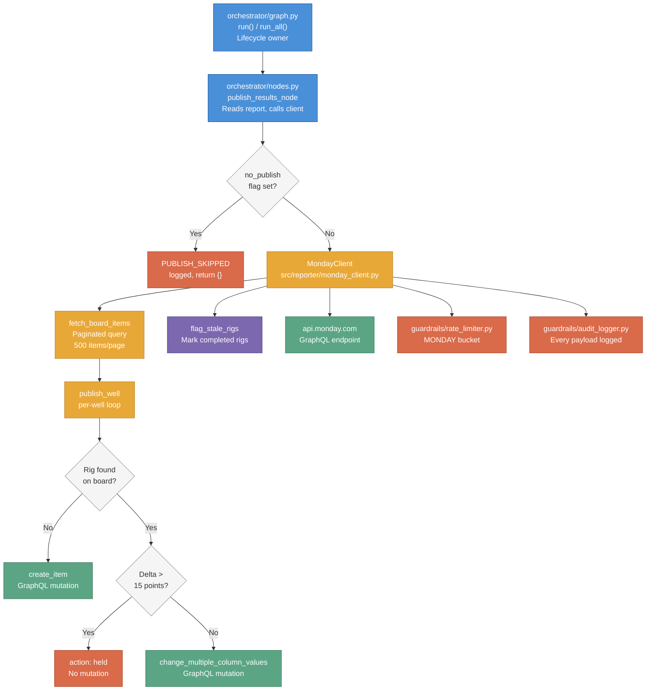

# Monday.com Integration

The Monday.com integration is the final step of every QC run: once all 29 checks have been evaluated and scores computed, the agent publishes those results to the live operations board that account managers and field staff use daily. It is the only place where QC data becomes visible outside the agent's local run directory. For a non-technical explanation of what those scores mean and how they are interpreted, see [Results and Impact](../results).

Last updated: 2026-04-10

---

## Purpose

`src/reporter/monday_client.py` owns all communication with Monday.com. It translates the agent's internal `CheckStatus` values and computed QC scores into GraphQL mutations against `api.monday.com`, updating one board row per active rig.

Monday.com is used as the output surface because the operations team already works there daily. Publishing directly to the board means no CSV exports, no manual copy-paste, and no lag between a run completing and the team seeing updated scores.

The client is deliberately synchronous (`requests`, not `httpx`). Publishing happens after the async LangGraph run has completed and the event loop has closed, so there is no async context to integrate with. This is documented as tech debt in the source file: if the client is ever called from within a running event loop it will need a thread-based bridge.

---

## How It Fits



**Upstream callers:** `orchestrator/nodes.py` (`publish_results_node`) is the only caller. It reads `qc_report.json` from `run_dir`, constructs a `MondayClient` with injected dependencies, and calls `publish_operator`.

**Downstream dependencies:**
- `api.monday.com` -- outbound GraphQL over HTTPS (allowlisted domain)
- `guardrails/rate_limiter.py` -- MONDAY bucket token acquired before every API call
- `guardrails/audit_logger.py` -- structured payload logging before every mutation
- `config/monday_boards.yaml` -- all board IDs and column IDs read from here, never hardcoded

---

## Design Decisions

### Upsert by rig name, not well name

**Decision:** The primary key for board lookup is the rig column (`text_mm1yhv0e`), not the item name (well name).

**Rationale:** Rigs persist on the board across wells. When a rig moves from `SMITH 1H` to `JONES 2H`, the board row for that rig already exists with history. Matching by rig preserves continuity and avoids creating duplicate rows every time a rig spuds a new well.

**Alternative rejected:** Matching by well name (item name). This would create a new row every time a rig moves to a new well, fragmenting history and bloating the board.

**Side effect handled:** When the rig matches but the well name has changed, a second mutation renames the item. Monday.com does not accept item name changes through `change_multiple_column_values`, so a separate `change_simple_column_value` mutation is required.

---

### Delta detection with 15-point threshold

**Decision:** If the new score differs from the previously published score by more than 15 points, the update is held (not written) and `action: "held"` is returned.

**Rationale:** A 15+ point swing in a single run is almost certainly a data quality problem, not a genuine improvement or regression. The first production run (April 3, 2026) published 111 incorrect scores because of browser session degradation. Delta detection provides a circuit breaker against future bulk-corruption events.

**Boundary behavior:** A delta of exactly 15.0 passes (the check is `delta > threshold`, not `>=`). A delta of 15.1 is held.

**Override:** `--force-publish` bypasses delta detection entirely. The `MONDAY_DELTA_SKIPPED` event is logged with `reason: "force-publish"` so the audit trail remains complete.

**First run:** When the agent score column is empty (no previous score), delta detection is skipped. There is no baseline to compare against.

---

### Payload logged before every mutation (Non-Negotiable #5)

**Decision:** `_graphql()` logs `MONDAY_API_REQUEST` with the query string (truncated to 200 chars) and a `has_variables` flag before executing the HTTP call. This happens on every call, including retries.

**Rationale:** Non-Negotiable #5 requires transparency: every action logged locally as structured JSON. If a mutation writes incorrect data to the board, the audit log must contain enough information to reconstruct exactly what was sent without re-running the agent.

**Alternative rejected:** Logging after the call completes. If the network call hangs or crashes, the post-call log entry is never written. Pre-call logging guarantees the intent is recorded even if execution fails.

---

### Rate limiter MONDAY bucket

**Decision:** Every call to `_graphql()` acquires a token from the MONDAY bucket of the rate limiter before executing.

**Rationale:** Non-Negotiable #2 (platform safety) requires rate control on all outbound API calls. Monday.com has its own rate limits separate from the AI Driller Cloud API. The MONDAY bucket is a separate token bucket with its own replenishment rate.

**Implementation note:** Because `publish_results_node` runs synchronously after the async LangGraph run, `_graphql()` calls `asyncio.run()` to acquire the token. This works correctly only because the event loop is not running at publish time.

---

### Board configuration externalized to `config/monday_boards.yaml`

**Decision:** All board IDs, group IDs, and column IDs live in `config/monday_boards.yaml`. `MondayClient` receives the parsed config dict as a constructor argument; it never reads the file itself.

**Rationale:** Column IDs are Monday.com internal identifiers that could change if columns are renamed or the board is restructured. Externalizing them means a board change requires editing one YAML file, not hunting through source code. Injecting the config dict (rather than reading it in the constructor) keeps the client testable without a filesystem.

**Alternative rejected:** Hardcoding column IDs as constants in `monday_client.py`. This would make board changes require code changes and re-deployment.

---

## Known Fixes (v0.8.0 -- 2026-04-09)

Two bugs in `flag_stale_rigs` and the item rename path were corrected after the first production API run.

### Stale rig detection was silently skipping all board items

**Root cause:** `flag_stale_rigs` filtered board items by comparing the `operator` column to the current operator name. Monday.com connect-boards columns always return `null` for the `text` field when queried via the `items_page` GraphQL endpoint -- the value is never populated regardless of actual board content. Every item failed the operator filter, so no rigs were ever flagged as stale.

**Fix:** The operator-scoped filter was removed. `flag_stale_rigs` now receives `all_active_rigs` -- the union of every rig across all operators in the full CSV -- and flags any board item whose rig name does not appear in that union. For `--well` and `--first` runs (where the full CSV is not loaded), stale flagging is skipped entirely to avoid false positives.

**Second bug:** The status column ID in `monday_boards.yaml` was configured as `"status"` (invalid; Monday.com internal IDs are alphanumeric codes). Corrected to `"color_mkwrhcwa"`. The status label was also configured as `"Completed"` but the board only has `"Active"` and `"Complete"` as valid values. Corrected to `"Complete"`.

---

### Item rename used wrong GraphQL variable type

**Root cause:** The rename mutation used `$value: JSON!` as the variable type. Monday.com's `change_simple_column_value` mutation requires `$value: String!`. Monday.com returns HTTP 200 with a GraphQL error body in this case, causing all retries to fail without raising an exception, silently leaving the well name stale on the board.

**Fix:** Variable type changed to `String!`; value passed as a plain Python string rather than `json.dumps`. A regression test was added that inspects the exact mutation string and variable dict to prevent recurrence.

---

## Board Configuration Reference

Source of truth: `config/monday_boards.yaml`

### Board and Group IDs

```yaml
active_wells_board:
  board_id: "18194532141"
  group_id: "1a844366-13c5-960d-8b25-9d78096657b4"  # "Active Well Assets" group
```

The `qc_trend_summary_board` section is defined in the config for planning purposes but is not yet used by any code (Phase 2 deliverable).

### Metadata Columns

These columns are read for lookup and operator scoping. The agent writes to `status` only (stale rig flagging).

| Purpose | Column ID | Notes |
|---|---|---|
| Well name (item name) | `name` | Monday.com built-in, not a custom column |
| Rig | `text_mm1yhv0e` | Primary key for upsert lookup |
| Operator | `operator` | Used for operator-scoped stale rig flagging |
| Status | `status` | Written to `"Completed"` for stale rigs |
| Basin | `basin` | Read-only reference |
| Last updated | `last_updated` | Read-only reference |

### Agent Score Column

| Purpose | Column ID | Type |
|---|---|---|
| Agent Total Quality Score | `numeric_mm21qrza` | Numeric, accepts float |

This column holds the agent-computed score (0-100). The board also has manual QC score columns (`formula_mkwsc3k0`, `formula_mkwrd5bp`, etc.) that the agent reads for historical comparison during the validation period but does not overwrite.

### Per-Check Status Columns

All 29 check columns use Monday.com status column type (`color_*` prefix). The column IDs below are the source of truth for what `MondayClient._build_check_column_map()` produces at construction time.

| Check Name | Column ID |
|---|---|
| WITSML Connected | `color_mkwra8n6` |
| Surveys | `color_mkwrpzaw` |
| Survey Program | `color_mkwrmbyw` |
| Survey Corrections | `color_mkwrqjsx` |
| Live Geosteering | `color_mkwr9ykt` |
| NPT Tracking | `color_mkwr4r65` |
| Cost Analysis | `color_mkwrykhh` |
| EDM Files | `color_mkwrk0pp` |
| Well Plans | `color_mkws6csz` |
| BHA Distro | `color_mkwrspdm` |
| BHA - Comments | `color_mkwrbv2v` |
| BHA - Uploads | `color_mkwrq36j` |
| BHA - Failure Reports | `color_mkwrs8vf` |
| BHA - Full Components | `color_mkwrt6gs` |
| Post Run BHAs | `color_mkwr8kx2` |
| Rig Inventory Data | `color_mkwr5k7s` |
| Tool Catalog Data | `color_mkya1d9w` |
| Mud Report Distro | `color_mkwryhxn` |
| Mud Program | `color_mky83aje` |
| Formation Tops | `color_mkwrhng1` |
| Roadmaps | `color_mky8k693` |
| Wellbore Diagrams | `color_mkwrcjmn` |
| Engineering Scenarios | `color_mkwrdv67` |
| AI Drill Prog | `color_mkzcg4rq` |
| AFE Curves | `color_mkynphja` |
| File Drive - BHAs | `color_mkzcsf69` |
| File Drive - Well Plans | `color_mkzc6k6t` |
| File Drive - Drill Prog | `color_mkyac7bc` |
| File Drive - Mud Reports | `color_mm1xpwaw` |

### Status Value Mapping

The agent's internal `CheckStatus` values map to Monday.com status column labels as follows:

| Agent Status | Monday.com Label | Notes |
|---|---|---|
| `YES` | `"Yes"` | |
| `YES_WITSML` | `"Yes - WITSML"` | |
| `YES_EMAIL` | `"Yes - Email"` | |
| `NO` | `"No"` | |
| `PARTIAL` | `"Partial"` | |
| `N_A` | `{}` (empty dict) | Clears the cell |
| `INCONCLUSIVE` | `"Inconclusive"` | |

`N_A` uses an empty dict `{}` rather than a label because Monday.com clears a status column when it receives an empty column value object.

---

## Public Interface

### `MondayClient.__init__`

```python
def __init__(
    self,
    api_token: str,
    rate_limiter,
    audit_logger,
    board_config: dict,
) -> None:
```

Constructs a client for one operator's board. `board_config` must be the parsed `active_wells_board` section from `monday_boards.yaml`. All board and column IDs are extracted at construction time. `api_token` is the raw Monday.com API token string (not prefixed).

**When to call:** `publish_results_node` in `orchestrator/nodes.py` constructs one instance per operator per run. The class is not a singleton and does not cache HTTP connections between runs.

---

### `MondayClient.publish_operator`

```python
def publish_operator(
    self,
    report: dict,
    delta_threshold: float = 15.0,
    force_publish: bool = False,
) -> dict:
```

Top-level entry point. Fetches all board items once, iterates through `report["wells"]`, calls `publish_well` for each, then calls `flag_stale_rigs`.

**Parameters:**
- `report` -- the dict produced by `src/reporter/run_report.py:build_run_report`. Must have `wells`, `operator.operator_name` keys.
- `delta_threshold` -- maximum allowed score change per run before the update is held. Default 15.0 points.
- `force_publish` -- if `True`, skips delta detection for all wells in this call.

**Returns:** Summary dict with keys `wells_published` (int), `wells_held` (int), `wells_created` (int), `stale_flagged` (int), `errors` (list of `{well_name, error}` dicts).

**Errors:** Individual well failures are caught and included in `errors`. Publishing errors never abort the run or raise to the caller.

---

### `MondayClient.publish_well`

```python
def publish_well(
    self,
    well_name: str,
    rig: str,
    check_results: dict,
    agent_score: float,
    items: list[dict],
    delta_threshold: float = 15.0,
    force_publish: bool = False,
) -> dict:
```

Publishes a single well. Performs rig lookup, delta check, and either creates or updates the board item.

**Parameters:**
- `well_name` -- used as the item name on creation and for rename detection on update.
- `rig` -- primary key for board lookup.
- `check_results` -- `{check_name: {"status": str}}` dict. Unknown check names (not in column map) are logged as `MONDAY_COLUMN_NOT_FOUND` and skipped.
- `agent_score` -- float 0-100, written to the agent score column rounded to 1 decimal place.
- `items` -- pre-fetched board items list from `fetch_board_items`. Callers pass the same list for all wells to avoid repeated fetches.

**Returns:** `{action, item_id, delta_held, error}` where `action` is one of `"updated"`, `"created"`, `"held"`, `"error"`.

---

### `MondayClient.fetch_board_items`

```python
def fetch_board_items(self) -> list[dict]:
```

Fetches all items from the board using cursor-based pagination (500 items per page). Returns a flat list of `{id, name, column_values}` dicts. Called once per `publish_operator` invocation and the result is passed to all per-well calls.

**GraphQL query structure (first page):**
```graphql
query ($boardId: ID!) {
    boards(ids: [$boardId]) {
        items_page(limit: 500) {
            cursor
            items {
                id
                name
                column_values { id text value }
            }
        }
    }
}
```

Subsequent pages use `next_items_page(cursor: $cursor, limit: 500)`.

---

### `MondayClient.flag_stale_rigs`

```python
def flag_stale_rigs(
    self,
    active_rigs: set[str],
    items: list[dict],
    operator_name: str | None = None,
) -> list[str]:
```

Sets the status column to `"Completed"` for any board item whose rig is not in `active_rigs`. Scopes to `operator_name` to avoid flagging another operator's rigs on the shared board.

**Returns:** List of rig name strings that were flagged. Failures per-rig are caught and logged as `MONDAY_STALE_FLAG_FAILED`.

---

### `MondayClient.find_item_by_rig`

```python
def find_item_by_rig(
    self,
    rig_name: str,
    items: list[dict],
) -> dict | None:
```

Linear scan of `items` looking for the first item whose rig column (`text_mm1yhv0e`) matches `rig_name`. Returns the item dict or `None`.

---

### `MondayClient.read_agent_score`

```python
def read_agent_score(self, item: dict) -> float | None:
```

Reads the current agent score from `numeric_mm21qrza` column. Returns `None` if the column is empty or non-numeric (first run, or data entry error). `None` means delta detection is skipped for that item.

---

### GraphQL Mutation: Update Existing Item

```graphql
mutation ($boardId: ID!, $itemId: ID!, $columnValues: JSON!) {
    change_multiple_column_values(
        board_id: $boardId,
        item_id: $itemId,
        column_values: $columnValues
    ) {
        id
    }
}
```

`columnValues` is a JSON-encoded dict mapping column IDs to their value objects. For status columns, the value is `{"label": "Yes"}`. For the numeric score column, the value is the float directly. For `N_A` status, the value is `{}` to clear the cell.

---

### GraphQL Mutation: Create New Item

```graphql
mutation ($boardId: ID!, $groupId: String!, $itemName: String!, $columnValues: JSON!) {
    create_item(
        board_id: $boardId,
        group_id: $groupId,
        item_name: $itemName,
        column_values: $columnValues
    ) {
        id
    }
}
```

---

### GraphQL Mutation: Rename Item

```graphql
mutation ($boardId: ID!, $itemId: ID!, $columnId: String!, $value: JSON!) {
    change_simple_column_value(
        board_id: $boardId,
        item_id: $itemId,
        column_id: $columnId,
        value: $value
    ) { id }
}
```

Used only when the rig matches an existing item but the well name has changed. Monday.com requires item name updates through this separate mutation (`columnId: "name"`).

---

## Internal Patterns

### Upsert Flow

1. `publish_operator` calls `fetch_board_items` once. The result is a flat list of all board items across all operators.
2. For each well in the report, `publish_well` calls `find_item_by_rig` (linear scan) to determine whether the item exists.
3. If found: run delta check (unless `force_publish`), then call `change_multiple_column_values`. If the well name changed, follow with a `change_simple_column_value` rename.
4. If not found: call `create_item` with the well name as item name, the group ID from config, and all column values.
5. The return dict `{action, item_id, delta_held, error}` is used by `publish_operator` to accumulate counts.

### Delta Detection Logic

Delta detection compares the new `agent_score` against the value in column `numeric_mm21qrza` on the existing board item. The comparison is:

```python
previous_score = self.read_agent_score(existing)
if previous_score is not None:
    delta = abs(agent_score - previous_score)
    if delta > delta_threshold:  # default 15.0
        # hold -- no mutation
```

Three conditions bypass delta detection:
1. `force_publish=True` -- explicit operator override
2. `previous_score is None` -- first run for this rig, no baseline
3. Item does not exist -- creation path has no previous score to compare

### Stale Rig Flagging

After all wells are published, `flag_stale_rigs` receives the set of rig names that appeared in the current CSV. It scans every board item, checks the operator column (to avoid cross-operator interference), and sets the status column to `"Completed"` for any rig not in the active set.

This is the agent's mechanism for indicating that a rig has rotated off a job or otherwise become inactive. The status is set, not the item deleted, to preserve historical score data.

### Retry Logic

`_graphql` retries on 5xx responses with fixed backoffs of `[5, 10, 20]` seconds (up to 3 attempts). 4xx responses fail immediately. 401 specifically logs `MONDAY_AUTH_ERROR` before raising. GraphQL-level errors (HTTP 200 with `errors` in the response body) raise `requests.HTTPError` immediately without retry because they indicate a structural problem with the mutation, not a transient server failure.

---

## Non-Negotiable Enforcement

| Non-Negotiable | How Enforced |
|---|---|
| **#1 Client data safety** | `flag_stale_rigs` scopes to `operator_name` to avoid flagging another operator's rigs on the shared board. Each `publish_operator` call is scoped to one operator's wells from the report. |
| **#2 Platform safety (API rate limiting)** | `_graphql` acquires a MONDAY bucket token via `asyncio.run(self._rate_limiter.acquire(...))` before every outbound call. No call bypasses this. |
| **#3 Accuracy** | Delta detection prevents bulk-corruption events from being silently published. `force_publish` is an explicit operator action, not a silent default. |
| **#4 Completeness** | Individual well errors are caught and included in the `errors` list. Publishing a well failing does not abort publishing for remaining wells. |
| **#5 Transparency** | `_graphql` logs `MONDAY_API_REQUEST` before execution. Every action (created, updated, renamed, held, stale-flagged, failed) has a corresponding named audit log event. |

---

## Testing Strategy

**Test file:** `tests/reporter/test_monday_client.py`

### What is tested

| Area | Tests |
|---|---|
| Status mapping | `STATUS_TO_MONDAY` covers every `CheckStatus` value |
| Column map construction | Real `monday_boards.yaml` produces 29 entries with correct IDs |
| Rig lookup | Found, not found, empty items list |
| Score reading | Present (float), empty (None), non-numeric (None) |
| Update existing | Mutation called, correct return dict |
| Create new | `create_item` mutation called, new ID returned |
| Delta held | No mutation when delta exceeds threshold; correct `delta_held` value |
| Delta boundary | Exactly 15.0 passes; 15.1 holds |
| First run (no score) | Update proceeds without delta check |
| Force publish | Delta skipped; `MONDAY_DELTA_SKIPPED` logged |
| Item rename | Two mutations when well name changes; `MONDAY_WELL_RENAMED` logged |
| No rename when names match | Single mutation |
| Missing column ID | `MONDAY_COLUMN_NOT_FOUND` logged; other columns still written |
| Stale rig scoping | Only flags rigs belonging to the specified operator |
| Full operator flow | 3-well scenario: update + held + create produces correct counts |
| `--no-publish` flag | `publish_results_node` skips when `no_publish=True` |
| Missing API token | Node skips when `MONDAY_API_TOKEN` not in environment |
| Report updated after publish | `monday_status.publish_status` updated to `"completed"` in `qc_report.json` |

### What is mocked

- `_graphql` is patched with `patch.object(client, "_graphql")` for all mutation tests. This isolates mutation logic from network behavior.
- `fetch_board_items` is patched for `publish_operator` tests to inject controlled item lists.
- `rate_limiter` is an `AsyncMock` with `acquire` mocked. No token bucket logic runs in tests.
- `audit_logger` is a `MagicMock`. Tests inspect `log.call_args_list` to verify event names.
- `MondayClient` class itself is patched in node-level tests via `patch("src.reporter.monday_client.MondayClient")`.
- Real `config/monday_boards.yaml` is loaded by the `board_config` fixture so column ID mapping tests verify against live config, not test fixtures.

### Coverage gaps

- `_graphql` retry logic (5xx backoff, 3 attempts) is not tested. The `requests.post` call would need patching with side effects to simulate 5xx responses.
- GraphQL-level error handling (`errors` in HTTP 200 response) is not tested.
- Cursor-based pagination in `fetch_board_items` for boards exceeding 500 items is not tested.

### How to run

```bash
# All reporter tests (score calculator, run report, monday client)
python -m pytest tests/reporter/ -v

# Monday client only
python -m pytest tests/reporter/test_monday_client.py -v

# Specific test
python -m pytest tests/reporter/test_monday_client.py::test_publish_well_delta_held -v
```
