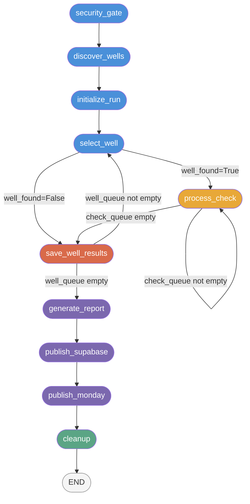

# Orchestrator

*Last updated: 2026-04-16*

The orchestrator is the control center of the QC Agent. It discovers wells via the search API, sequences the QC checks for every well, routes data through the API layer, feeds results into the rule engine, and triggers reporting and publishing. For a non-technical overview of the full workflow, see [How It Works](../how-it-works). For the four-layer design and how the orchestrator relates to the API and rules layers, see [Architecture](architecture).

---

## Purpose

The orchestrator implements a deterministic, multi-well state machine. Its responsibilities are:

1. Validate the security environment before touching any data.
2. Discover active wells for the target operator via the search API.
3. Resolve each well's full detail from the API, then execute all checks against live API data.
4. Accumulate per-well results and compute QC scores.
5. Write JSON reports, publish to Supabase (score-of-record), and publish to Monday.com (operator summary).

LangGraph was chosen over a plain `asyncio` loop for two reasons. First, it provides a formal state schema (`QCAgentState`) with a clear contract about what data exists at each stage of execution -- this eliminates the class of bugs caused by nodes reading state that has not yet been written. Second, the conditional edge system makes loop control (process next check vs. move to next well vs. report) an explicit, testable part of the graph definition rather than buried control flow inside node functions.

---

## How It Fits



The graph has three conditional edges:

- **After `select_well`**: routes to `process_check` on success, or to `save_well_results` if the well was not found in the platform (it is added to `unreachable_wells`).
- **After `process_check`**: loops back to `process_check` if checks remain in the queue, otherwise routes to `save_well_results`.
- **After `save_well_results`**: loops back to `select_well` if more wells remain in the queue, otherwise routes to `generate_report`.

The linear tail (`generate_report -> publish_supabase -> publish_monday -> cleanup -> END`) always executes once per operator invocation.

---

## Design Decisions

### LangGraph StateGraph over a plain async loop

A plain `asyncio` loop was the obvious alternative. The reason LangGraph was chosen is the formal state contract. Every node receives a typed `QCAgentState` dict and returns only the fields it modifies. LangGraph merges those partial updates into the state, so a node can never accidentally read a stale field or overwrite a field another node depends on without it being visible in code. The graph topology -- nodes, edges, conditional edges -- is also defined once in `graph.py:_build_graph()` and tested independently of node logic, which catches wiring bugs before they reach integration tests.

The tradeoff is that LangGraph requires all state values to be serializable (no live objects in `QCAgentState`). This is enforced by design: see the next decision.

### Live resources on class instance, not in LangGraph state

`APIClient`, `RuleEngine`, `AuditLogger`, `RateLimiter`, and `resource_cache` all live as instance attributes on `QCAgentGraph`, not in `QCAgentState`. The reason is serialization. LangGraph state must be JSON-serializable; an open `httpx.AsyncClient` connection pool, a file handle in `AuditLogger`, or a Python object reference in the rule engine cannot be serialized.

The pattern used is closure injection: `graph.py` wraps each node function in a bound method (e.g., `_node_process_check`) that passes `self._api_client` and `self._resource_cache` as arguments. From LangGraph's perspective, each node is a callable that takes a state dict and returns a dict. The live resources are invisible to the framework but always available inside the node.

This also means that live resources survive across well iterations without being stored in state -- the `APIClient` connection pool stays open for the full duration of a `run()` or `run_all()` call because it is held by the graph instance, not passed through state.

### resource_cache cleared between wells

`resource_cache` is a mutable dict on `QCAgentGraph` that stores API responses within a single well. Multiple checks share endpoints: `get_bha_list` is called by checks 10, 11, 12, 13, 14, and 15, for example. Without caching, each check would make a redundant network call.

The cache is cleared in `save_well_results_node` via `resource_cache.clear()`. This is Non-Negotiable #1: no cross-well data contamination. If the cache were not cleared, BHA data from Well A would be visible during Well B's check execution. The `is not None` check pattern is used throughout (not `or {}`) to distinguish "no cache" from "cache exists but is empty" -- the latter would otherwise silently create a new dict and break cache sharing.

### INCONCLUSIVE per check, not run-abort on API failure

API failures are stateless and isolated: a timeout on one endpoint does not affect subsequent calls. When any API fetch or adapter call raises an exception, `_process_check_api` catches it, logs `API_FETCH_FAILURE` with the error type and message, and returns an `INCONCLUSIVE` result for that check. The run continues. This behavior is implemented in `nodes.py`. The browser-era `browser_dead` routing logic was removed in v0.7.0.

---

## QCAgentState Reference

`QCAgentState` is defined in `src/orchestrator/state.py` as a `TypedDict` with `total=False`. All fields are optional at graph start; they are populated progressively by nodes.

| Field | Type | Set by | Purpose |
|---|---|---|---|
| `target_well` | `str \| None` | `run()` entry | Specific well UUID for `--well` mode; `None` otherwise |
| `target_checks` | `list[int] \| None` | `run()` entry | Check numbers from `--checks` CLI arg; `None` = all checks |
| `mode` | `str` | `run()` entry | `"well"`, `"first"`, or `"all"` |
| `run_mode` | `str` | `run()` entry | `"active"` or `"historical"` |
| `operator_id` | `str` | `run()` entry | Operator UUID from whitelist; `None` signals ad-hoc `--well` run |
| `target_operator` | `str \| None` | `run_all()` | Which operator this graph invocation handles |
| `wells_discovered` | `int` | `discover_wells_node` | Search count pre-flight result |
| `whitelist_status_ids` | `list[int]` | `discover_wells_node` | Status IDs used for discovery; used for mismatch detection |
| `spud_date` | `str \| None` | `select_well_node` | From search response; `None` for `--well` mode |
| `status_name` | `str \| None` | `select_well_node` | Well status string from search response |
| `well_name` | `str` | `select_well_node` | Current well under evaluation |
| `operator` | `str` | `discover_wells_node` | Operator name; scopes all output |
| `rig` | `str` | `select_well_node` | Rig name from search response |
| `basin` | `str` | `select_well_node` | Basin; injected into `extracted_data` for timezone-aware checks |
| `well_queue` | `list[dict]` | `discover_wells_node`; consumed by `select_well_node` | Remaining wells to process |
| `completed_wells` | `list[dict]` | `save_well_results_node` | Accumulated results per well |
| `unreachable_wells` | `list[str]` | `select_well_node` | Well names that could not be resolved |
| `well_uuid` | `str \| None` | `select_well_node` | Platform UUID for the current well |
| `check_queue` | `list[dict]` | `initialize_run_node`; consumed by `process_check_node` | Ordered list of YAML check configs to run |
| `full_check_queue` | `list[dict]` | `initialize_run_node` | Unfiltered check queue; used by `generate_report_node` |
| `checks_queued` | `int` | `initialize_run_node` | Total checks in queue after filtering |
| `current_module_key` | `str \| None` | `save_well_results_node` | Reset to `None` between wells |
| `check_results` | `dict[str, dict]` | `process_check_node` | Map of `check_name -> result_dict`; cleared between wells |
| `run_id` | `str` | `initialize_run_node` | UUID for the run; written to report |
| `run_timestamp` | `str` | `initialize_run_node` | ISO 8601 UTC timestamp of run start |
| `run_dir` | `str` | `initialize_run_node` | Output directory path |
| `owns_audit_logger` | `bool` | `initialize_run_node` | `True` when this node opened the audit log file (vs. `run_all()`) |
| `well_start_time` | `float \| None` | `select_well_node` | `time.time()` when the current well started |
| `run_start_time` | `float \| None` | `initialize_run_node` | `time.time()` when the run started |
| `well_found` | `bool` | `select_well_node` | Controls routing after `select_well` |
| `no_publish` | `bool` | `run()` entry | If `True`, `publish_monday_node` skips Monday.com |
| `force_publish` | `bool` | `run()` entry | If `True`, bypasses delta detection |
| `circuit_breaker_aborted` | `bool` | `process_check_node` | `True` if per-well circuit breaker tripped |
| `errors` | `list[dict]` | `initialize_run_node` | Non-fatal error accumulator; written to report |

---

## Node Reference

### Node 1: `security_gate_node`

Calls `guardrails/security_gate.py:run_gate()`, which verifies the security policy before any other code runs. Checks include: LangChain tracing disabled, no `LANGCHAIN_API_KEY` present, no telemetry imports. On any failure, `run_gate()` raises `SecurityPolicyViolation` and the graph halts immediately.

- **Reads**: nothing from state (reads environment directly)
- **Writes**: nothing (returns `{}`)
- **Errors**: raises `SecurityPolicyViolation` on policy violation

---

### Node 2: `discover_wells_node`

Discovers active wells for the target operator via the search API. Reads operator config from the whitelist, runs a `search_count` pre-flight check against the discovery ceiling, optionally compares against the previous run via Supabase, then runs the full well search to build `well_queue`.

For `--well <uuid>` mode, the queue is pre-populated before graph invocation and this node is a no-op.

- **Reads**: `target_operator`, `well_queue` (pre-populated check), `run_mode`
- **Writes**: `well_queue`, `operator`, `operator_id`, `wells_discovered`, `whitelist_status_ids`
- **Errors**: API failures logged; empty result still proceeds (zero-well run)

---

### Node 3: `initialize_run_node`

Generates run metadata (UUID, timestamp, output directory), opens the audit log file (when not owned by `run_all()`), builds the ordered check queue from YAML configs in `config/modules/`, applies any `--checks` filter, and calls `engine.start_well()`.

Check queue ordering rules (enforced by `_build_check_queue`):
1. Check 1 (WITSML Connected, `module_key=null`) is placed first unconditionally.
2. Remaining checks are grouped by `navigation.module_key`.
3. Within each group: dependency checks last, `requires_extractor=false` before `requires_extractor=true`.

When `--checks` is used, `_filter_check_queue` adds any undeclared dependencies automatically and logs `CHECK_DEPENDENCY_AUTO_INCLUDED` for each auto-inclusion.

- **Reads**: `operator`, `well_name`, `target_checks`, `mode`, `run_dir` (pre-set only in `run_all()`)
- **Writes**: `run_id`, `run_timestamp`, `run_dir`, `owns_audit_logger`, `check_queue`, `full_check_queue`, `checks_queued`, `check_results`, `current_module_key`, `errors`
- **Errors**: raises `FileNotFoundError` if `config/modules/` is missing

---

### Node 4: `select_well_node`

Pops the first well from `well_queue` and fetches well detail via the API. If the API call raises or the well is unreachable, it is added to `unreachable_wells` and `well_found` is set to `False`, routing to `save_well_results` (skipping `process_check`).

Also detects status mismatches: if the well detail's `status_id` does not match the whitelist status IDs used for discovery, logs `WELL_STATUS_MISMATCH`.

- **Reads**: `well_queue`, `unreachable_wells`, `whitelist_status_ids`
- **Writes**: `well_name`, `rig`, `basin`, `spud_date`, `status_name`, `well_uuid`, `well_found`, `well_queue` (remaining), `well_start_time`
- **Errors**: caught internally; API errors become `well_found=False`, logged as `API_WELL_RESOLUTION_FAILED`

---

### Node 5: `process_check_node`

The concurrent evaluation node (v0.8.0+). On each invocation, processes all checks in `check_queue` in a single call using a two-wave parallel gather pattern. The routing function invokes this node once per well; the node returns when all checks are complete.

**Two-wave execution:**

`_split_into_waves` divides `check_queue` into wave 1 (no dependencies) and wave 2 (checks that depend on a wave 1 result). Wave 1 runs first via `asyncio.gather`; wave 2 begins only after all wave 1 results are available.

Each check runs through `_run_single_check`, which calls `_fetch_and_evaluate` wrapped in `asyncio.wait_for(timeout=check_timeout_seconds)`.

**`_fetch_and_evaluate` steps:**
1. Look up `strategy` in `API_STRATEGY_MAP`. Unknown strategy logs `UNKNOWN_API_STRATEGY` and returns `INCONCLUSIVE`.
2. For each `(method_name, arg_type)` in the fetch list, fetch from the API or serve from `resource_cache` via `_coalesced_fetch`.
3. Call the adapter function with all fetched responses plus any `strategy_params`.
4. Inject `basin` and `system_time` into `extracted_data`.
5. Call `engine.evaluate(check_name, extracted_data)` (synchronous).

Any exception produces `INCONCLUSIVE` for that check. The remaining checks are not affected.

**Concurrency control:** `asyncio.Semaphore(semaphore_size)` caps the number of checks running simultaneously. Default `semaphore_size=8` from `config/agent.yaml`.

**Request coalescing:** When two checks need the same API endpoint, only one fetch goes to the network. The second caller waits on a per-endpoint `asyncio.Lock` and reads from `resource_cache` when the first caller completes. The `_FETCH_FAILED` sentinel in the cache distinguishes a failed fetch from a cache miss.

**Wave 2 dependency resolution:** Before each wave 2 check executes, the accumulated results are inspected. If the dependency result is `INCONCLUSIVE`, the dependent check inherits `INCONCLUSIVE` without making any API call. If the dependency condition is met, the engine computes the result with an empty `extracted_data` dict.

**Per-well circuit breaker:** `_CircuitBreakerState` tracks consecutive and total timeouts within a single well. When `consecutive_timeout_limit` or `total_timeout_limit` is reached, remaining checks are skipped and `circuit_breaker_aborted=True` is returned.

**Run-level circuit breaker:** The injected `run_cb_state` tracks consecutive aborted wells across the full run. When `consecutive_well_abort_limit` is exceeded, `well_queue` is drained to stop the run.

- **Reads**: `check_queue`, `check_results`, `well_uuid`, `basin`, `well_queue`
- **Writes**: `check_queue` (emptied), `check_results` (all checks), `circuit_breaker_aborted`, and potentially `well_queue` (drained on run-level trip)
- **Errors**: all exceptions produce `INCONCLUSIVE` for the affected check; timeouts increment circuit breaker counters

---

### Node 6: `save_well_results_node`

Saves the current well's results into `completed_wells`, then resets per-well state for the next iteration. Extracts `api_uwi`, `end_date`, and `end_depth` from `resource_cache` before clearing it. Clears `resource_cache` to prevent cross-well data leaks (Non-Negotiable #1). Rebuilds `check_queue` from `full_check_queue` so the next well starts with a full queue.

If `check_results` is empty (the well was unreachable and no checks ran), the entry is not added to `completed_wells`.

- **Reads**: `well_name`, `rig`, `spud_date`, `status_name`, `check_results`, `well_start_time`, `well_queue`, `full_check_queue`, `target_checks`, `unreachable_wells`
- **Writes**: `completed_wells`, `unreachable_wells`, `well_queue`, `check_results` (reset), `check_queue` (rebuilt), `current_module_key` (reset), `well_start_time` (reset)
- **Side effects**: `resource_cache.clear()` (mutates the graph instance dict)

---

### Node 7: `generate_report_node`

Assembles the JSON run report from `completed_wells`. Delegates scoring to `reporter/score_calculator.py` and report construction to `reporter/run_report.py`. Populates timing fields and coverage stats.

- **Reads**: `run_id`, `run_timestamp`, `run_dir`, `operator`, `completed_wells`, `unreachable_wells`, `full_check_queue`, `target_checks`, `run_start_time`, `run_mode`
- **Writes**: `report_path`
- **Side effects**: writes `qc_report.json` to `run_dir`; writes historical CSV for historical runs

---

### Node 8: `publish_supabase_node`

Writes per-well results to the Supabase `well_results` table. Runs on every operator run regardless of `no_publish` flag (Supabase is the score-of-record). Skipped only if `SUPABASE_URL` / `SUPABASE_KEY` are not set.

- **Reads**: `completed_wells`, `operator`, `operator_id`, `run_dir`, `run_mode`
- **Writes**: nothing to state (returns `{}`)
- **Side effects**: HTTP upserts to Supabase

---

### Node 9: `publish_monday_node`

Reads the JSON report and upserts a single operator summary row to the Monday.com summary board. Skipped for historical runs, ad-hoc `--well` runs, `--no-publish` flag, missing API token, or missing board config.

- **Reads**: `run_mode`, `operator_id`, `no_publish`, `operator`, `completed_wells`, `run_dir`, `run_timestamp`
- **Writes**: nothing to state (returns `{}`)
- **Side effects**: Monday.com GraphQL mutations

---

### Node 10: `cleanup_node`

Flushes and closes the audit logger. Skips `clear_output()` when `run_all()` owns the logger lifecycle (signalled by `owns_audit_logger=False`). All operations are wrapped in `try/except` -- cleanup never raises.

- **Reads**: `owns_audit_logger`
- **Writes**: nothing (returns `{}`)
- **Side effects**: `audit_logger.clear_output()` when `owns_audit_logger=True`

---

### Routing Functions

| Function | Condition | Destination |
|---|---|---|
| `route_after_select_well` | `well_found=True` | `process_check` |
| `route_after_select_well` | `well_found=False` | `save_well_results` |
| `route_after_check` | `check_queue` not empty | `process_check` |
| `route_after_check` | `check_queue` empty | `save_well_results` |
| `route_after_save_well` | `well_queue` not empty | `select_well` |
| `route_after_save_well` | `well_queue` empty | `generate_report` |

---

## API_STRATEGY_MAP

`API_STRATEGY_MAP` (nodes.py) maps YAML extraction strategy names to the API calls and adapter functions needed to evaluate each check.

### Structure of each entry

```python
"strategy_name": {
    "fetch": [
        ("api_client_method_name", arg_type),
        ...
    ],
    "adapter": adapter_function,
}
```

`arg_type` controls how `_process_check_api` calls the method:

| arg_type | How it's called | Use case |
|---|---|---|
| `"uuid"` | `method(well_uuid)` | Single-resource fetch (most checks) |
| `"per_actual_bha"` | `method(well_uuid, bha_id)` for each Actual BHA | BHA detail data (checks 14, 15) |
| `"per_actual_bha_id"` | `method(bha_id)` for each Actual BHA | BHA files (check 11/12) |

### Full strategy map (25 strategies, 30 checks)

| Strategy | Checks | Primary fetch method | Adapter |
|---|---|---|---|
| `witsml_connected` | 1 | `get_well_detail` | `adapt_witsml_status` |
| `surveys` | 2 | `get_surveys`, `get_well_detail` | `adapt_surveys` |
| `survey_program` | 3 | `get_survey_program` | `adapt_presence_check` |
| `survey_corrections` | 4 | `get_surveys` | `adapt_survey_corrections` |
| `geosteering` | 5 | `get_geosteering` | `adapt_geosteering` |
| `npt_tracking` | 6 | `get_npt_hazards` | `adapt_presence_check` |
| `cost_analysis` | 7 | `get_cost_analysis` | `adapt_presence_check` |
| `edm_files` | 8 | `get_edm_history` | `adapt_presence_check` |
| `well_plan` | 9 | `get_survey_plans` | `adapt_well_plans` |
| `bha_grid` | 10 | `get_bha_list` | `adapt_bha_grid` |
| `bha_drawer_data` | 11, 12 | `get_bha_list`, `get_bha_files` (per BHA) | `adapt_bha_drawer_data` |
| `bha_failure_flags` | 13 | `get_bha_list` | `adapt_bha_failure_flags` |
| `bha_components` | 14 | `get_bha_list`, `get_bha_details` (per BHA) | `adapt_bha_components` |
| `bha_grade_out` | 15 | `get_bha_list`, `get_bha_details` (per BHA) | `adapt_bha_grade_out` |
| `rig_inventory` | 16 | `get_rig_inventory` | `adapt_presence_check` |
| `tool_catalog` | 17 | `get_tool_catalog` | `adapt_presence_check` |
| `mud_distro` | 18 | `get_mud_reports` | `adapt_mud_distro` |
| `mud_program` | 19 | `get_mud_program` | `adapt_presence_check` |
| `formation_tops` | 20 | `get_formation_tops` | `adapt_presence_check` |
| `roadmaps` | 21 | `get_roadmaps` | `adapt_presence_check` |
| `wellbore_designs` | 22 | `get_wellbore_designs` | `adapt_wellbore_designs` |
| `engineering_scenarios` | 23 | `get_engineering_scenarios` | `adapt_presence_check` |
| `drilling_program` | 24 | `get_drilling_program` | `adapt_presence_check` |
| `afe_curves` | 25 | `get_afe_curves` | `adapt_presence_check` |
| `file_drive` | 26-29 | `get_file_drive_tree` | `adapt_file_drive` |
| `location` | 30 | `get_well_detail` | `adapt_location` |

---

## csv_parser.py

`src/orchestrator/csv_parser.py` is a preserved utility module. It is not called by the v0.9.0+ orchestrator workflow (well discovery is API-driven), but it remains available for offline analysis and is not deleted.

---

## Non-Negotiable Enforcement

| Non-negotiable | Where enforced |
|---|---|
| **#1 Client data safety** (no cross-operator mixing) | `save_well_results_node`: `resource_cache.clear()` between wells; `completed_wells` accumulates only current operator's wells; `run_all()` invokes the graph once per operator |
| **#2 Platform safety** (read-only, rate-limited) | All API calls are GET or read-only POST; rate limiter applied via `APIClient`; no write operations anywhere in the orchestrator |
| **#3 Accuracy** (deterministic, INCONCLUSIVE not guessed) | All evaluation via `engine.evaluate()`; API failures and timeouts return `INCONCLUSIVE` not a guess; wave 2 dependency check prevents evaluation against INCONCLUSIVE dependency results |
| **#4 Completeness** (every well, every check) | `well_queue` exhausted before `generate_report`; unreachable wells tracked in `unreachable_wells`; coverage stats written to report |
| **#5 Transparency** (every action logged) | All nodes produce audit log events at every decision point; all API failures logged before `INCONCLUSIVE` is returned |

---

## Testing Strategy

### Test files

| File | What it covers |
|---|---|
| `tests/orchestrator/test_nodes.py` | All node functions and routing functions, in isolation |
| `tests/orchestrator/test_graph.py` | `QCAgentGraph` construction, node wiring |
| `tests/orchestrator/test_csv_parser.py` | All `parse_csv` scenarios |

### What is mocked

- `AuditLogger`: replaced with `MagicMock()` with a `.log` method.
- `RuleEngine`: `.evaluate()` returns a fixed `CheckResult(status=CheckStatus.YES)` unless overridden.
- `APIClient`: `AsyncMock()` with individual endpoint methods stubbed per test.
- `resource_cache`: passed as a real dict so cache hit/miss behavior is exercised.
- `RateLimiter`, `APIAuth`: patched at construction in `test_graph.py`.

### How to run

```bash
python -m pytest tests/orchestrator/ -v
python -m pytest tests/ -v
```
