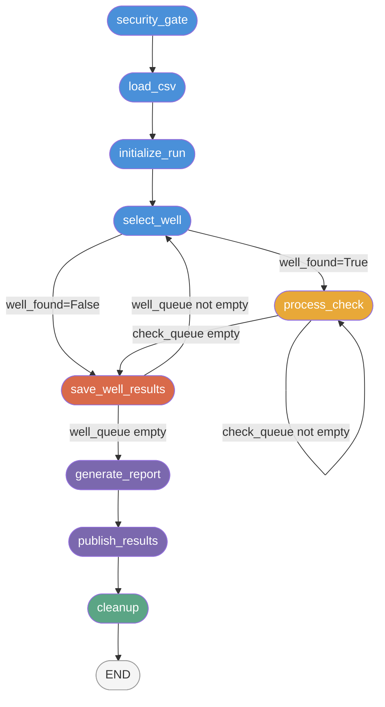

# Orchestrator

The orchestrator is the control center of the QC Agent. It sequences the 29 QC checks for every well in the input CSV, routes data through the API layer, feeds results into the rule engine, and triggers reporting and Monday.com publishing. For a non-technical overview of the full workflow, see [How It Works](../how-it-works). For the four-layer design and how the orchestrator relates to the API and rules layers, see [Architecture](architecture).

Last updated: 2026-04-10

---

## Purpose

The orchestrator implements a deterministic, multi-well state machine. Its responsibilities are:

1. Validate the security environment before touching any data.
2. Parse the input CSV and build an ordered well queue.
3. Resolve each well's UUID from the API, then execute all 29 checks against live API data.
4. Accumulate per-well results and compute QC scores.
5. Write JSON reports and publish to Monday.com.

LangGraph was chosen over a plain `asyncio` loop for two reasons. First, it provides a formal state schema (`QCAgentState`) with a clear contract about what data exists at each stage of execution -- this eliminates the class of bugs caused by nodes reading state that has not yet been written. Second, the conditional edge system makes loop control (process next check vs. move to next well vs. report) an explicit, testable part of the graph definition rather than buried control flow inside node functions.

---

## How It Fits



The graph has three conditional edges:

- **After `select_well`**: routes to `process_check` on success, or to `save_well_results` if the well was not found in the platform (it is added to `unreachable_wells`).
- **After `process_check`**: loops back to `process_check` if checks remain in the queue, otherwise routes to `save_well_results`.
- **After `save_well_results`**: loops back to `select_well` if more wells remain in the queue, otherwise routes to `generate_report`.

The three linear tails (`generate_report -> publish_results -> cleanup -> END`) always execute once per operator invocation.

---

## Design Decisions

### LangGraph StateGraph over a plain async loop

A plain `asyncio` loop was the obvious alternative. The reason LangGraph was chosen is the formal state contract. Every node receives a typed `QCAgentState` dict and returns only the fields it modifies. LangGraph merges those partial updates into the state, so a node can never accidentally read a stale field or overwrite a field another node depends on without it being visible in code. The graph topology -- nodes, edges, conditional edges -- is also defined once in `graph.py:_build_graph()` and tested independently of node logic, which catches wiring bugs before they reach integration tests.

The tradeoff is that LangGraph requires all state values to be serializable (no live objects in `QCAgentState`). This is enforced by design: see the next decision.

### Live resources on class instance, not in LangGraph state

`APIClient`, `RuleEngine`, `AuditLogger`, `RateLimiter`, and `resource_cache` all live as instance attributes on `QCAgentGraph`, not in `QCAgentState`. The reason is serialization. LangGraph state must be JSON-serializable; an open `httpx.AsyncClient` connection pool, a file handle in `AuditLogger`, or a Python object reference in the rule engine cannot be serialized.

The pattern used is closure injection: `graph.py` wraps each node function in a bound method (e.g., `_node_process_check`) that passes `self._api_client` and `self._resource_cache` as arguments. From LangGraph's perspective, each node is a callable that takes a state dict and returns a dict. The live resources are invisible to the framework but always available inside the node.

This also means that live resources survive across well iterations without being stored in state -- the `APIClient` connection pool stays open for the full duration of a `run()` or `run_all()` call because it is held by the graph instance, not passed through state.

### resource_cache cleared between wells

`resource_cache` is a mutable dict on `QCAgentGraph` that stores API responses within a single well. Multiple checks share endpoints: `get_bha_list` is called by checks 10, 11, 12, 13, 14, and 15, for example. Without caching, each check would make a redundant network call.

The cache is cleared in `save_well_results_node` via `resource_cache.clear()` (nodes.py line 1007). This is Non-Negotiable #1: no cross-well data contamination. If the cache were not cleared, BHA data from Well A would be visible during Well B's check execution. The `is not None` check pattern is used throughout (not `or {}`) to distinguish "no cache" from "cache exists but is empty" -- the latter would otherwise silently create a new dict and break cache sharing.

### Callback pattern for the well search cache

The full well list from `get_well_search()` returns 17k+ wells and changes only when rigs are added or removed. Fetching it once per well would be wasteful. But the list cannot be stored in `QCAgentState` without bloating every state snapshot LangGraph manages.

The solution is a callback: `select_well_node` accepts an optional `well_search_cache: list | None` and an `on_cache_update` callable. On the first well, `well_search_cache` is `None`; the node calls `get_well_search()`, then calls `on_cache_update(wells)` which sets `self._well_search_cache` on the graph instance. On subsequent wells, `well_search_cache` is populated and no network call is needed. The callback pattern keeps the cache storage entirely outside LangGraph state while giving `select_well_node` a clean, testable interface.

### INCONCLUSIVE per check, not run-abort on API failure

The browser era had a `browser_dead` flag because a Playwright crash corrupted all subsequent extractions -- the failure mode was contagious. API failures are stateless and isolated: a timeout on one endpoint does not affect subsequent calls. When any API fetch or adapter call raises an exception, `_process_check_api` catches it, logs `API_FETCH_FAILURE` with the error type and message, and returns an `INCONCLUSIVE` result for that check. The run continues. This behavior is implemented in nodes.py lines 849-859. The `browser_dead` routing logic was removed in v0.7.0.

---

## QCAgentState Reference

`QCAgentState` is defined in `src/orchestrator/state.py` as a `TypedDict` with `total=False`. All fields are optional at graph start; they are populated progressively by nodes.

| Field | Type | Set by | Purpose |
|---|---|---|---|
| `csv_path` | `str` | `run()` entry | Path to the input CSV manifest |
| `target_well` | `str \| None` | `run()` entry | Specific well name for `--well` mode; `None` otherwise |
| `target_checks` | `list[int] \| None` | `run()` entry | Check numbers from `--checks` CLI arg; `None` = all 29 |
| `mode` | `str` | `run()` entry | `"well"`, `"first"`, or `"all"` |
| `target_operator` | `str \| None` | `run_all()` | Which operator this graph invocation handles in `--all` mode |
| `well_name` | `str` | `load_csv_node`, `select_well_node` | Current well under evaluation |
| `operator` | `str` | `load_csv_node` | Operator name for the well queue; scopes all output |
| `rig` | `str` | `load_csv_node`, `select_well_node` | Rig name from CSV |
| `basin` | `str` | `load_csv_node`, `select_well_node` | Basin from CSV; injected into `extracted_data` for timezone-aware checks |
| `well_queue` | `list[dict]` | `load_csv_node`; consumed by `select_well_node` | Remaining wells to process; each entry is `{well_name, rig, basin}` |
| `completed_wells` | `list[dict]` | `save_well_results_node` | Accumulated results; each entry is `{well_name, rig, check_results, timing_seconds}` |
| `unreachable_wells` | `list[str]` | `select_well_node` | Well names that could not be resolved to a UUID |
| `well_uuid` | `str \| None` | `select_well_node` | Platform UUID for the current well; used by API calls |
| `check_queue` | `list[dict]` | `initialize_run_node`; consumed by `process_check_node` | Ordered list of YAML check configs to run |
| `full_check_queue` | `list[dict]` | `initialize_run_node` | Unfiltered check queue; used by `generate_report_node` for coverage calculations |
| `checks_queued` | `int` | `initialize_run_node` | Total checks in queue after `--checks` filtering; used by report |
| `current_module_key` | `str \| None` | `save_well_results_node` | Reset to `None` between wells |
| `check_results` | `dict[str, dict]` | `process_check_node` | Map of `check_name -> result_dict`; cleared between wells |
| `run_id` | `str` | `initialize_run_node` | UUID for the run; written to report |
| `run_timestamp` | `str` | `initialize_run_node` | ISO 8601 UTC timestamp of run start |
| `run_dir` | `str` | `initialize_run_node` | Output directory path (e.g., `runs/20260407_Acme_Oil/`) |
| `well_start_time` | `float \| None` | `select_well_node` | `time.time()` when the current well started; cleared by `save_well_results_node` |
| `run_start_time` | `float \| None` | `load_csv_node` | `time.time()` when the run started; used for total duration |
| `login_success` | `bool` | (removed) | No longer written; browser login path removed in v0.7.0 |
| `well_found` | `bool` | `select_well_node` | Controls routing after `select_well` |
| `browser_dead` | `bool` | (removed) | No longer written; browser layer removed in v0.7.0 |
| `no_publish` | `bool` | `run()` entry | If `True`, `publish_results_node` skips Monday.com |
| `force_publish` | `bool` | `run()` entry | If `True`, bypasses delta detection in `MondayClient` |
| `errors` | `list[dict]` | `initialize_run_node` | Non-fatal error accumulator; written to report |

---

## Node Reference

### Node 1: `security_gate_node`

Calls `guardrails/security_gate.py:run_gate()`, which verifies the security policy before any other code runs. Checks include: LangChain tracing disabled, no `LANGCHAIN_API_KEY` present, no telemetry imports. On any failure, `run_gate()` raises `SecurityPolicyViolation` and the graph halts immediately.

- **Reads**: nothing from state (reads environment directly)
- **Writes**: nothing (returns `{}`)
- **Errors**: raises `SecurityPolicyViolation` on policy violation

---

### Node 2: `load_csv_node`

Parses the input CSV using `csv_parser.parse_csv()` and builds the well queue. Supports three modes:

- `--well`: queue of one specific well (matched by name)
- `--first`: queue of one well (first row of CSV)
- `--all`: all wells for `target_operator`

If the target well is not found in the CSV, raises `ValueError`. Rejected rows (empty required fields) are collected in `ParseResult.rejected_rows` and logged but do not stop the run.

- **Reads**: `csv_path`, `target_well`, `mode`, `target_operator`
- **Writes**: `well_name`, `operator`, `rig`, `basin`, `well_queue`, `completed_wells`, `unreachable_wells`, `run_start_time`
- **Errors**: raises `ValueError` for missing target well; raises `CSVParseError` for structural problems (missing file, missing columns)

---

### Node 3: `initialize_run_node`

Generates run metadata (UUID, timestamp, output directory), builds the ordered check queue from YAML configs in `config/modules/`, applies any `--checks` filter, and calls `engine.start_well()`.

Check queue ordering rules (enforced by `_build_check_queue`):
1. Check 1 (WITSML Connected, `module_key=null`) is placed first unconditionally.
2. Remaining checks are grouped by `navigation.module_key`.
3. Within each group: dependency checks last, `requires_extractor=false` before `requires_extractor=true`.

When `--checks` is used, `_filter_check_queue` adds any undeclared dependencies automatically and logs `CHECK_DEPENDENCY_AUTO_INCLUDED` for each auto-inclusion.

- **Reads**: `operator`, `well_name`, `target_checks`, `mode`, `run_dir` (for `--all` mode)
- **Writes**: `run_id`, `run_timestamp`, `run_dir`, `check_queue`, `full_check_queue`, `checks_queued`, `check_results`, `current_module_key`, `errors`
- **Errors**: raises `FileNotFoundError` if `config/modules/` is missing

---

### Node 4: `select_well_node`

Pops the first well from `well_queue` and resolves its platform UUID from the API well search endpoint. Uses a run-level cache (callback pattern -- see Design Decisions) to avoid calling `get_well_search()` more than once per run. If the API call raises or the well name does not appear in the search results, the well is added to `unreachable_wells` and `well_found` is set to `False`, which routes to `save_well_results` (skipping `process_check`).

- **Reads**: `well_queue`, `unreachable_wells`
- **Writes**: `well_name`, `rig`, `basin`, `well_uuid`, `well_found`, `well_queue` (remaining), `well_start_time`
- **Errors**: caught internally; API errors become `well_found=False`, logged as `API_WELL_RESOLUTION_FAILED`

---

### Node 5: `process_check_node`

The concurrent evaluation node (v0.8.0+). On each invocation, processes all checks in `check_queue` in a single call using a two-wave parallel gather pattern. The routing function invokes this node once per well; the node returns when all checks are complete.

**Two-wave execution:**

`_split_into_waves` divides `check_queue` into wave 1 (no dependencies) and wave 2 (checks that depend on a wave 1 result). Wave 1 runs first via `asyncio.gather`; wave 2 begins only after all wave 1 results are available.

Each check runs through `_run_single_check`, which calls `_fetch_and_evaluate` wrapped in `asyncio.wait_for(timeout=check_timeout_seconds)`.

**`_fetch_and_evaluate` steps:**
1. Look up `strategy` in `API_STRATEGY_MAP`. Unknown strategy logs `UNKNOWN_API_STRATEGY` and returns `INCONCLUSIVE`.
2. For each `(method_name, arg_type)` in the fetch list, fetch from the API or serve from `resource_cache` via `_coalesced_fetch`.
3. Call the adapter function with all fetched responses plus any `strategy_params`.
4. Inject `basin` and `system_time` into `extracted_data`.
5. Call `engine.evaluate(check_name, extracted_data)` (synchronous).

Any exception produces `INCONCLUSIVE` for that check. The remaining checks are not affected.

**Concurrency control:** `asyncio.Semaphore(semaphore_size)` caps the number of checks running simultaneously. Default `semaphore_size=8` from `config/agent.yaml`.

**Request coalescing:** When two checks need the same API endpoint, only one fetch goes to the network. The second caller waits on a per-endpoint `asyncio.Lock` and reads from `resource_cache` when the first caller completes. The `_FETCH_FAILED` sentinel in the cache distinguishes a failed fetch from a cache miss.

**Wave 2 dependency resolution:** Before each wave 2 check executes, the accumulated results are inspected. If the dependency result is `INCONCLUSIVE`, the dependent check inherits `INCONCLUSIVE` without making any API call. If the dependency condition is met (e.g., Surveys = NO triggers N_A for Survey Corrections), the engine computes the N_A result with an empty `extracted_data` dict.

**Per-well circuit breaker:** `_CircuitBreakerState` tracks consecutive and total timeouts within a single well. When `consecutive_timeout_limit` or `total_timeout_limit` is reached, remaining checks are skipped and `circuit_breaker_aborted=True` is returned. The consecutive count resets on any successful check.

**Run-level circuit breaker:** The injected `run_cb_state` tracks consecutive aborted wells across the full run. When `consecutive_well_abort_limit` is exceeded, `well_queue` is drained to stop the run. (Architectural note: draining `well_queue` from within a check-execution node is a known design smell tracked in TASKS.md v0.8.1 for refactor into a dedicated routing flag.)

- **Reads**: `check_queue`, `check_results`, `well_uuid`, `basin`, `well_queue`
- **Writes**: `check_queue` (emptied), `check_results` (all checks), `circuit_breaker_aborted`, and potentially `well_queue` (drained on run-level trip)
- **Errors**: all exceptions produce `INCONCLUSIVE` for the affected check; timeouts increment circuit breaker counters

---

### Node 6: `save_well_results_node`

Saves the current well's results into `completed_wells`, then resets per-well state for the next iteration. Clears `resource_cache` to prevent cross-well data leaks (Non-Negotiable #1). Rebuilds `check_queue` from `full_check_queue` (with `--checks` filter re-applied if needed) so the next well starts with a full queue.

If `check_results` is empty (the well was unreachable and no checks ran), the entry is not added to `completed_wells` -- the well was already recorded in `unreachable_wells` by `select_well_node`.

- **Reads**: `well_name`, `rig`, `check_results`, `well_start_time`, `well_queue`, `full_check_queue`, `target_checks`, `unreachable_wells`
- **Writes**: `completed_wells`, `unreachable_wells`, `well_queue`, `check_results` (reset to `{}`), `check_queue` (rebuilt), `current_module_key` (reset to `None`), `well_start_time` (reset to `None`)
- **Side effects**: `resource_cache.clear()` (mutates the graph instance dict)

---

### Node 7: `generate_report_node`

Assembles the JSON run report from `completed_wells`. Delegates scoring to `reporter/score_calculator.py` (`compute_well_score`, `compute_operator_score`) and report construction to `reporter/run_report.py` (`build_run_report`, `write_report`, `write_summary`). Populates timing fields and coverage stats (unreachable wells, manifest size, coverage percentage).

For multi-well runs, the operator-level score is the average of all well scores. For single-well runs, the well score is used directly.

- **Reads**: `run_id`, `run_timestamp`, `run_dir`, `operator`, `completed_wells`, `unreachable_wells`, `full_check_queue`, `target_checks`, `run_start_time`, `csv_path`
- **Writes**: `report_path`
- **Side effects**: writes `qc_report.json` and `summary.txt` to `run_dir`

---

### Node 8: `publish_results_node`

Reads the JSON report from disk and publishes to Monday.com via `reporter/monday_client.py`. Skipped if `no_publish` is `True` or `MONDAY_API_TOKEN` is not set. After publishing, updates `monday_status` in the report file with publish statistics (wells published, wells held, wells created, stale flagged).

`force_publish=True` bypasses delta detection in `MondayClient` -- every score is written regardless of whether it has changed. This is used to overwrite known-bad scores.

- **Reads**: `no_publish`, `force_publish`, `run_dir`
- **Writes**: nothing to state (returns `{}`)
- **Side effects**: Monday.com GraphQL mutations; updates `qc_report.json` on disk

---

### Node 9: `cleanup_node`

Flushes and closes the audit logger. In `--all` mode, audit logger lifecycle is owned by `run_all()` in `graph.py`, so `cleanup_node` skips `clear_output()` to avoid closing the shared logger mid-run. All operations are wrapped in `try/except` -- cleanup never raises.

- **Reads**: `mode`
- **Writes**: nothing (returns `{}`)
- **Side effects**: `audit_logger.clear_output()` (flushes log buffer to disk)

---

### Routing Functions

| Function | Condition | Destination |
|---|---|---|
| `route_after_select_well` | `well_found=True` | `process_check` |
| `route_after_select_well` | `well_found=False` | `save_well_results` |
| `route_after_check` | `check_queue` not empty | `process_check` |
| `route_after_check` | `check_queue` empty | `save_well_results` |
| `route_after_save_well` | `well_queue` not empty | `select_well` |
| `route_after_save_well` | `well_queue` empty | `generate_report` |

---

## API_STRATEGY_MAP

`API_STRATEGY_MAP` (nodes.py lines 84-217) maps YAML extraction strategy names to the API calls and adapter functions needed to evaluate each check.

### Structure of each entry

```python
"strategy_name": {
    "fetch": [
        ("api_client_method_name", arg_type),
        ...
    ],
    "adapter": adapter_function,
}
```

`arg_type` controls how `_process_check_api` calls the method:

| arg_type | How it's called | Use case |
|---|---|---|
| `"uuid"` | `method(well_uuid)` | Single-resource fetch (most checks) |
| `"per_actual_bha"` | `method(well_uuid, bha_id)` for each Actual BHA | BHA detail data (checks 14, 15) |
| `"per_actual_bha_id"` | `method(bha_id)` for each Actual BHA | BHA files (check 11/12) |

For `per_actual_bha` and `per_actual_bha_id`, the BHA list must already be in `resource_cache` from an earlier `fetch` entry in the same spec. If it is not (e.g., because `--checks` skipped the `bha_grid` check), the loop over Actual BHAs produces no results and the adapter receives an empty list, which typically evaluates as `NO` or `INCONCLUSIVE`.

### Caching behavior

Cache keys use the format `"{method_name}:{well_uuid}"` for `uuid` arg type, or `"{method_name}:{bha_id}"` for per-BHA calls. On a cache hit, `API_CACHE_HIT` is logged with the check name and method. The cache is cleared by `save_well_results_node` between wells.

### File drive checks (26-29)

The `file_drive` strategy passes `strategy_params["folder_name"]` as a keyword argument to `adapt_file_drive`. Each of the four file drive checks has a different `folder_name` in its YAML `extraction.params`. Without this parameter, the adapter cannot look up the correct folder and will silently return `INCONCLUSIVE`.

### Missing strategy

If a YAML config references a strategy name not in `API_STRATEGY_MAP`, `_process_check_api` logs `UNKNOWN_API_STRATEGY` and returns `INCONCLUSIVE` for that check. The run continues. This is a safety net for configuration errors during development.

### Full strategy map (25 strategies, 29 checks)

| Strategy | Checks | Primary fetch method | Adapter |
|---|---|---|---|
| `witsml_connected` | 1 | `get_well_detail` (cached from well selection) | `adapt_witsml_status` |
| `surveys` | 2 | `get_surveys`, `get_well_detail` | `adapt_surveys` |
| `survey_program` | 3 | `get_survey_program` | `adapt_presence_check` |
| `survey_corrections` | 4 | `get_surveys` | `adapt_survey_corrections` |
| `geosteering` | 5 | `get_geosteering` | `adapt_geosteering` |
| `npt_tracking` | 6 | `get_npt_hazards` | `adapt_presence_check` |
| `cost_analysis` | 7 | `get_cost_analysis` | `adapt_presence_check` |
| `edm_files` | 8 | `get_edm_history` | `adapt_presence_check` |
| `well_plan` | 9 | `get_survey_plans` | `adapt_well_plans` |
| `bha_grid` | 10 | `get_bha_list` | `adapt_bha_grid` |
| `bha_drawer_data` | 11, 12 | `get_bha_list`, `get_bha_files` (per BHA) | `adapt_bha_drawer_data` |
| `bha_failure_flags` | 13 | `get_bha_list` | `adapt_bha_failure_flags` |
| `bha_components` | 14 | `get_bha_list`, `get_bha_details` (per BHA) | `adapt_bha_components` |
| `bha_grade_out` | 15 | `get_bha_list`, `get_bha_details` (per BHA) | `adapt_bha_grade_out` |
| `rig_inventory` | 16 | `get_rig_inventory` | `adapt_presence_check` |
| `tool_catalog` | 17 | `get_tool_catalog` | `adapt_presence_check` |
| `mud_distro` | 18 | `get_mud_reports` | `adapt_mud_distro` |
| `mud_program` | 19 | `get_mud_program` | `adapt_presence_check` |
| `formation_tops` | 20 | `get_formation_tops` | `adapt_presence_check` |
| `roadmaps` | 21 | `get_roadmaps` | `adapt_presence_check` |
| `wellbore_designs` | 22 | `get_wellbore_designs` | `adapt_wellbore_designs` |
| `engineering_scenarios` | 23 | `get_engineering_scenarios` | `adapt_presence_check` |
| `drilling_program` | 24 | `get_drilling_program` | `adapt_presence_check` |
| `afe_curves` | 25 | `get_afe_curves` | `adapt_presence_check` |
| `file_drive` | 26-29 | `get_file_drive_tree` | `adapt_file_drive` |

---

## csv_parser.py

`src/orchestrator/csv_parser.py` is a pure parsing module with no dependencies on the rest of the orchestrator. It uses the `csv` stdlib (no pandas) to stay lightweight.

### What it returns

`parse_csv(path)` returns a `ParseResult` dataclass containing:

- `wells_by_operator`: `dict[str, list[WellRecord]]` -- all accepted wells, keyed by operator name
- `rejected_rows`: `list[dict]` -- rows with empty required fields; each entry includes `{row, reason, raw}`
- `warnings`: `list[str]` -- duplicate well+operator combinations (first occurrence kept)
- `total_rows_read`: `int`

`WellRecord` is a frozen dataclass with fields: `well_name`, `rig`, `operator`, `source_row` (1-based), `basin` (empty string if absent or a missing marker).

### Column normalization

All CSV headers are stripped and lowercased before lookup. Both BI export headers and short names are accepted:

| BI export header | Short header | Internal field |
|---|---|---|
| `Well name` | `well_name` | `well_name` |
| `Rig Name` | `rig` | `rig` |
| `Operator Name` | `operator` | `operator` |
| `Basin Name` | `basin` | `basin` |

Extra columns are ignored. BOM characters (`\xef\xbb\xbf`) from Excel exports are stripped via `utf-8-sig` encoding.

### Basin field

`basin` is optional. If the column is absent, `basin` defaults to `""`. If the column is present, values in `MISSING_MARKERS` (`{"-", "n/a", "none", "null", ""}`) are normalized to `""`. The basin value is passed through state and injected into every check's `extracted_data` dict, where timezone-aware rules use it for UTC offset lookups.

### Missing marker handling

Row-level rejections use `CSVParseError` for structural issues (missing file, missing required column header) and `rejected_rows` accumulation for row-level issues (empty required field). The distinction matters: structural errors halt the run before any state is created; row-level rejections are reported but do not stop the run.

### Duplicate detection

Duplicate `(well_name, operator)` pairs generate a warning and the second occurrence is silently dropped. The same well name under different operators is not a duplicate.

---

## Non-Negotiable Enforcement

| Non-negotiable | Where enforced |
|---|---|
| **#1 Client data safety** (no cross-operator mixing) | `save_well_results_node`: `resource_cache.clear()` between wells; `completed_wells` accumulates only current operator's wells; `run_all()` invokes the graph once per operator |
| **#2 Platform safety** (read-only, rate-limited) | All API calls are GET or read-only POST; rate limiter applied via `APIClient`; no write operations anywhere in the orchestrator |
| **#3 Accuracy** (deterministic, INCONCLUSIVE not guessed) | All evaluation via `engine.evaluate()`; API failures and timeouts return `INCONCLUSIVE` not a guess; wave 2 dependency check prevents evaluation against INCONCLUSIVE dependency results |
| **#4 Completeness** (every well, every check) | `well_queue` exhausted before `generate_report`; unreachable wells tracked in `unreachable_wells`; coverage stats written to report |
| **#5 Transparency** (every action logged) | `security_gate_node`, `load_csv_node`, `initialize_run_node`, `select_well_node`, `process_check_node`, and `save_well_results_node` all produce audit log events at every decision point; all API failures logged before `INCONCLUSIVE` is returned |

---

## Testing Strategy

### Test files

| File | What it covers |
|---|---|
| `tests/orchestrator/test_nodes.py` | All node functions and routing functions, in isolation |
| `tests/orchestrator/test_graph.py` | `QCAgentGraph` construction, node wiring, absence of deprecated browser nodes |
| `tests/orchestrator/test_csv_parser.py` | All `parse_csv` scenarios |
| `tests/orchestrator/test_state.py` | State schema validation |

### What is mocked

- `AuditLogger`: replaced with `MagicMock()` with a `.log` method; assertions verify which events were emitted and with what arguments.
- `RuleEngine`: `.evaluate()` returns a fixed `CheckResult(status=CheckStatus.YES)` unless a specific test overrides it.
- `APIClient`: `AsyncMock()` with individual endpoint methods stubbed per test.
- `resource_cache`: passed as a real dict so cache hit/miss behavior is exercised.
- `RateLimiter`, `APIAuth`: patched at construction in `test_graph.py` to avoid singleton and network side effects.

### Key test patterns

- **Routing functions** are tested with plain dicts, no mocks needed (e.g., `route_after_select_well({"well_found": True}) == "process_check"`).
- **Check queue ordering** uses `tmp_path` YAML fixtures to verify that WITSML is first, dependencies come after non-dependency checks, and `requires_extractor=false` checks precede `requires_extractor=true` checks.
- **API resolution** verifies that a miss (no matching name) and an API exception both produce `well_found=False`, add the well to `unreachable_wells`, and log the appropriate event.
- **Cache hit** is tested by pre-populating `resource_cache` and verifying that `mock_api` methods are not called.
- **Browser node absence** is explicitly tested in `test_graph.py` (`test_graph_browser_nodes_not_present`) to guard against regression.

### Coverage gaps

- `generate_report_node` and `publish_results_node` are tested via integration tests in `tests/reporter/`, not in the orchestrator test suite directly. The orchestrator tests mock the reporter layer.
- The `run_all()` multi-operator loop has no dedicated unit test; it is covered by the operator-level integration test.
- The `--checks` dependency auto-inclusion has unit tests for the `_filter_check_queue` function but is not tested end-to-end through the full graph.

### How to run

```bash
# All orchestrator tests
python -m pytest tests/orchestrator/ -v

# Specific test files
python -m pytest tests/orchestrator/test_nodes.py -v
python -m pytest tests/orchestrator/test_csv_parser.py -v

# Full suite
python -m pytest tests/ -v
```
