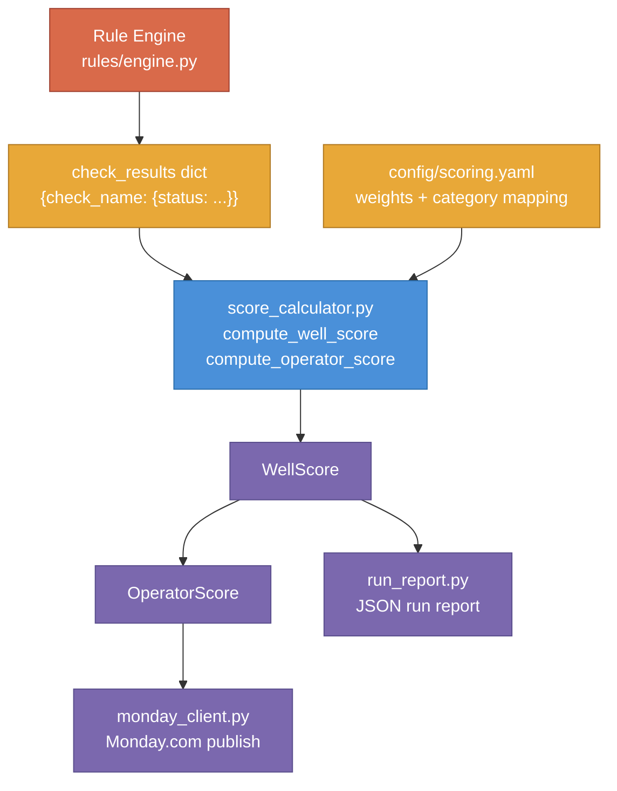

# Scoring Engine

*Last updated: 2026-04-16*

The scoring engine converts per-check evaluation results into a single 0-100 QC score for each well, then aggregates those well scores into an operator-level score. It is the authoritative implementation of the scoring method described in [Scoring](../scoring). All score computation happens in `src/reporter/score_calculator.py`.

---

## Purpose

`score_calculator.py` computes QC scores from check results. It takes the dict of check outcomes produced by the rule engine and the category configuration from `config/scoring.yaml`, and returns structured score objects that the reporter uses to publish to Monday.com and write run reports.

The module is deliberately pure computation: no I/O, no API calls, no browser interaction, no logging. This makes it independently unit testable with static inputs and ensures that the same check results always produce the same score (Non-Negotiable #3: deterministic rules, same data = same result).

---

## How It Fits

The scoring engine sits between the rule engine output and the reporter output layer. For the overall system design, see [Architecture](architecture). For the non-technical scoring description, see [Scoring](../scoring).



The rule engine produces a flat dict of check results keyed by check name. `score_calculator.py` groups those results by category, averages within each category, then computes a weighted total across categories. The resulting `WellScore` and `OperatorScore` objects are consumed by `run_report.py` for the JSON artifact and `monday_client.py` for the Monday.com upsert.

---

## Design Decisions

### Two-step weighted scoring

**Decision:** Category scores are computed first (average of applicable checks within the category), then the category scores are combined into a weighted total.

**Rationale:** A flat average across all 29 checks would give disproportionate weight to large categories. BHA has 6 checks; File Drive has 4. A two-step approach lets the config express that BHA data matters more than File Drive data via the weight field, independently of how many checks live in each category. The operator can add or remove checks from a category without changing its relative importance.

**Alternative rejected:** Single-pass weighted average over all checks individually. Rejected because it ties category importance to check count, which makes the config harder to reason about and means adding a new check implicitly changes the weight of every other check.

### Pure dataclasses with no I/O

**Decision:** `score_calculator.py` contains no file reads (except via `load_scoring_config`), no network calls, no logging calls, and no LangGraph state access.

**Rationale:** Keeping computation separate from I/O is the single most important thing that makes the scoring logic testable and auditable. Tests can run with static inputs, no mocks, and no environment setup. Any scoring bug is reproducible with a handful of dicts. The module also becomes independently verifiable: to audit a score, copy the check results and the config into a test and run `compute_well_score`.

**Alternative rejected:** Accepting a LangGraph state object directly. Rejected because it would couple the computation to the orchestrator's state schema, making it impossible to test without a full graph setup and making it fragile to state schema changes.

### Config-driven weights

**Decision:** Category weights and check-to-category assignments are declared in `config/scoring.yaml`. The computation module reads them at call time via `load_scoring_config`.

**Rationale:** Weights are a business decision, not a code decision. They need to change without a code deployment. Keeping them in YAML makes changes reviewable in git diff, keeps the Python free of business logic constants, and allows the design LLM to propose weight adjustments without touching source files.

**Alternative rejected:** Hardcoded `CATEGORY_WEIGHTS` dict in `nodes.py`. This was the original approach (present through v0.4.0). It was moved to `scoring.yaml` in v0.5.0 because it mixed business configuration with orchestration logic and made weight changes require a code review.

### Status-to-score mapping

**Decision:** `STATUS_SCORES` in `src/rules/models.py` maps each `CheckStatus` to a numeric value (1.0, 0.5, 0.0) or `None`. The scoring engine uses `None` to exclude a check from the denominator rather than counting it as zero.

**Rationale:** `N_A` and `INCONCLUSIVE` mean different things from `NO`. `NO` means the data is missing and that absence penalizes the score. `N_A` means the check does not apply to this well. `INCONCLUSIVE` means the agent could not determine status and requires human review. Treating either as 0 would unfairly penalize wells where checks are genuinely inapplicable or where extraction failed. Excluding them from the denominator preserves the integrity of the score for the checks that did run.

**Alternative rejected:** Mapping `INCONCLUSIVE` to 0.5 as a neutral mid-point. Rejected because it would silently mask extraction failures: a well where five checks returned `INCONCLUSIVE` due to API errors would score the same as a well that actually passed those checks at half credit.

---

## Data Models

### CheckStatus enum

Defined in `src/rules/models.py`. All scoring references to status go through this enum.

| Value | Score | Meaning |
|---|---|---|
| `YES` | 1.0 | Check passed; data present and correct |
| `YES_WITSML` | 1.0 | Check passed; data sourced from WITSML feed |
| `YES_EMAIL` | 0.5 | Check passed via email confirmation; half credit |
| `NO` | 0.0 | Check failed; data missing or incorrect |
| `PARTIAL` | 0.5 | Some data present but incomplete |
| `N_A` | `None` (excluded) | Check does not apply to this well |
| `INCONCLUSIVE` | `None` (excluded) | Agent could not determine status; human review required |

`None` means the check is excluded from the category denominator entirely.

### CategoryScore dataclass

```python
@dataclass
class CategoryScore:
    category: str           # Category name from scoring.yaml (e.g., "BHA")
    weight: int             # Integer weight from scoring.yaml
    score: float | None     # 0-100 average of applicable checks; None if all excluded
    applicable_checks: int  # Count of checks that contributed a numeric score
    total_checks: int       # Count of checks present in results for this category
    check_details: list[dict]  # Per-check breakdown: check_name, status, score_value, excluded
```

`score` is `None` (not zero) when every check in the category is `N_A` or `INCONCLUSIVE`. A `None` category is excluded from the weighted total denominator, so it does not drag the well score toward zero.

### WellScore dataclass

```python
@dataclass
class WellScore:
    well_name: str                           # Well identifier
    total_score: float                       # 0-100 weighted average, rounded to 4 decimal places
    category_scores: dict[str, CategoryScore]  # Keyed by category name
    checks_passed: int                       # Count of YES + YES_WITSML + YES_EMAIL
    checks_failed: int                       # Count of NO
    checks_partial: int                      # Count of PARTIAL
    checks_na: int                           # Count of N_A
    checks_inconclusive: int                 # Count of INCONCLUSIVE
```

`checks_passed` includes all three passing statuses (`YES`, `YES_WITSML`, `YES_EMAIL`) regardless of the 0.5 credit difference between `YES_EMAIL` and the other two. The status tallies are for observability and reporting, not for recomputing scores.

### OperatorScore dataclass

```python
@dataclass
class OperatorScore:
    operator_name: str                        # Operator identifier
    total_score: float                        # Simple average of well total_scores, 4 decimal places
    well_scores: list[WellScore]              # All wells for this operator
    well_count: int                           # Number of wells scored
    category_averages: dict[str, float | None]  # Per-category average across wells
```

The operator total is a simple (unweighted) average of well scores, not a re-application of the category weighting. Per-category averages exclude wells where that category was `None`.

---

## Public Interface

### `load_scoring_config`

```python
def load_scoring_config(config_path: str = "config/scoring.yaml") -> dict:
```

Loads and validates the scoring configuration from YAML. Returns the full config dict, shaped as `{"active": {category_name: {"weight": int, "checks": list[str]}}, "historical": {...}}`.

**Parameters:**
- `config_path`: Path to the scoring YAML file. Defaults to `config/scoring.yaml`.

**Returns:** Dict with `"active"` and `"historical"` sub-keys. Pass this dict directly to `compute_well_score` -- do not select a sub-key before passing.

**Raises:**
- `FileNotFoundError`: If the config file does not exist at the given path.
- `ValueError`: If the config is missing the `categories` key, either `active` or `historical` sub-key is absent, any category is missing a `weight` or `checks` key, a weight is not a positive integer, or a check name appears in more than one category within a mode block.

**When to call:** Once per run in the orchestrator, before processing wells. The result is passed to `compute_well_score` for each well. Do not re-read the file per well.

---

### `compute_well_score`

```python
def compute_well_score(
    well_name: str,
    check_results: dict[str, dict],
    scoring_config: dict,
    run_mode: str = "active",
) -> WellScore:
```

Computes the QC score for a single well using two-step weighted scoring.

**Parameters:**
- `well_name`: String identifier for the well. Used for labeling only; no lookup performed.
- `check_results`: Dict of `{check_name: {"status": str, ...}}`. The `"status"` key must be a valid `CheckStatus` value string. Additional keys in each result dict are ignored.
- `scoring_config`: The full config dict returned by `load_scoring_config`, shaped as `{"active": {...}, "historical": {...}}`. Not re-read from disk inside this function.
- `run_mode`: Which weight block to select. `"active"` (default) uses all 7 categories. `"historical"` uses the 3-category historical block. Any other value raises `ValueError`.

**Returns:** `WellScore` with `total_score` rounded to 4 decimal places, per-category breakdown, and status tallies. Active runs populate `category_scores` with 7 keys; historical runs populate 3 keys.

**Errors:** Raises `ValueError` on an unrecognized `run_mode`, or from `CheckStatus(result["status"])` if any status string is not a valid `CheckStatus` value. All other failures propagate as exceptions; there are no silent fallbacks inside this function.

**When to call:** Once per well, after the rule engine has produced all check results for that well. Called in `orchestrator/nodes.py` inside `generate_report_node` and `publish_supabase_node`.

---

### `compute_operator_score`

```python
def compute_operator_score(
    operator_name: str,
    well_scores: list[WellScore],
) -> OperatorScore:
```

Aggregates well scores into an operator-level score.

**Parameters:**
- `operator_name`: String identifier for the operator.
- `well_scores`: List of `WellScore` objects for this operator. May be empty.

**Returns:** `OperatorScore`. If `well_scores` is empty, returns an `OperatorScore` with `total_score=0.0`, `well_count=0`, and `category_averages={}`.

**When to call:** Once per operator, after all wells for that operator have been scored. Called in `reporter/run_report.py` during report assembly.

---

## Scoring Math

### Step 1: Check status to numeric score

Each check result carries a `status` string. The engine converts it to a `CheckStatus` enum value and looks up its numeric score in `STATUS_SCORES`:

```
score_value = STATUS_SCORES[CheckStatus(result["status"])]
```

`score_value` is 1.0, 0.5, 0.0, or `None`. A `None` score value means the check is excluded from category averaging.

### Step 2: Category average

For each category, the engine sums the numeric scores of applicable checks (those with non-`None` score values) and divides by the count of applicable checks:

```
category_score = (sum of score_values for applicable checks) / (count of applicable checks)
category_score_0_to_100 = category_score * 100
```

If no checks in the category are applicable (all `N_A` or `INCONCLUSIVE`), `category_score` is `None`.

Example from COUSIN EDDY (Live Data category, weight 4):
- WITSML Connected: YES_WITSML = 1.0
- Live Geosteering: NO = 0.0
- Cost Analysis: NO = 0.0
- NPT Tracking: NO = 0.0
- Category score = (1.0 + 0.0 + 0.0 + 0.0) / 4 * 100 = **25.0**

### Step 3: Weighted total

The engine computes a weighted average across categories. Only categories with non-`None` scores participate; their weights are summed to form the denominator:

```
weighted_sum = sum(category_score * weight for each non-None category)
weight_sum   = sum(weight for each non-None category)
total_score  = weighted_sum / weight_sum   (or 0.0 if weight_sum == 0)
total_score  = round(total_score, 4)
```

Example from COUSIN EDDY (all 7 categories have scores):

| Category | Score | Weight | Contribution |
|---|---|---|---|
| BHA | 100.0 | 5 | 500 |
| Trajectory and AC | 100.0 | 5 | 500 |
| Live Data | 25.0 | 4 | 100 |
| Drilling Reports | 25.0 | 3 | 75 |
| Engineering | 75.0 | 2 | 150 |
| Tool Inventory and Tracking | 50.0 | 2 | 100 |
| File Drive | 25.0 | 1 | 25 |
| **Total** | | **22** | **1450** |

`total_score = 1450 / 22 = 65.9091`

### Step 4: Operator aggregation

The operator total is a simple (unweighted) average of well total scores:

```
operator_total = sum(well.total_score for well in well_scores) / len(well_scores)
operator_total = round(operator_total, 4)
```

Per-category operator averages are computed the same way, excluding wells where that category was `None`.

---

## config/scoring.yaml Reference

The config file is at `config/scoring.yaml`. The `scoring_method` field documents the algorithm name (`weighted_category_average_v1`). The `categories` key contains two sub-keys: `active` and `historical`.

### Active mode (7 categories, 29 checks)

| Category | Weight | Checks |
|---|---|---|
| BHA | 5 | BHA Distro, BHA - Comments, BHA - Uploads, BHA - Failure Reports, BHA - Full Components, Post Run BHAs |
| Trajectory and AC | 5 | Surveys, Survey Program, Survey Corrections, EDM Files, Well Plans |
| Live Data | 4 | WITSML Connected, Live Geosteering, Cost Analysis, NPT Tracking |
| Drilling Reports | 3 | Mud Report Distro, Mud Program, Formation Tops, AI Drill Prog, AFE Curves |
| Engineering | 2 | Roadmaps, Wellbore Diagrams, Engineering Scenarios |
| Tool Inventory and Tracking | 2 | Rig Inventory Data, Tool Catalog Data |
| File Drive | 1 | File Drive - BHAs, File Drive - Well Plans, File Drive - Drill Prog, File Drive - Mud Reports |

Active weights sum to 22. Total checks: 29.

### Historical mode (3 categories, 13 checks)

Used when `run_mode="historical"` (completed wells). Live-data-only checks (WITSML, Geosteering, NPT, Cost Analysis), tool inventory checks, and file drive checks are excluded. Check 30 (Location) is included only in this mode.

| Category | Weight | Checks |
|---|---|---|
| BHA | 5 | BHA Distro, BHA - Comments, BHA - Uploads, BHA - Failure Reports, BHA - Full Components, Post Run BHAs |
| Trajectory and AC | 5 | Surveys, EDM Files, Well Plans, Location |
| Supporting Data | 3 | Mud Report Distro, Formation Tops, Wellbore Diagrams |

Historical weights sum to 13. Total checks: 13.

**Check names in both blocks must match the `check_name` field in each `config/modules/*.yaml` exactly.** `load_scoring_config` validates that no check name appears in more than one category within a given mode block, but does not validate that check names match the modules directory. Mismatches produce missing checks in results (logged as skipped, not raised as errors).

**Historical YAML variants:** Some checks have `_historical.yaml` config variants in `config/modules/` that define different evaluation logic for completed wells. The rule engine automatically skips `_historical.yaml` files on active runs and loads them only when `run_mode="historical"` is passed to `_build_check_queue`.

---

## Non-Negotiable Enforcement

| Non-Negotiable | Enforcement in scoring engine |
|---|---|
| #1 Client data safety (operator isolation) | `compute_operator_score` takes an explicit `operator_name` and a list of `WellScore` objects. The caller (orchestrator) is responsible for passing only wells belonging to one operator. The engine has no visibility into other operators' data. |
| #3 Accuracy (deterministic, INCONCLUSIVE not a guess) | `INCONCLUSIVE` maps to `None` in `STATUS_SCORES`, which excludes it from the denominator. It never contributes a numeric value. The formula is deterministic: the same inputs always produce the same output. |
| #3 Accuracy (no silent fallbacks) | `compute_well_score` raises `ValueError` on an invalid status string. Missing checks (not in `check_results`) are skipped with no contribution, not defaulted to zero. The `check_details` list in each `CategoryScore` records which checks were present and which were excluded. |
| #4 Completeness (no silent omissions) | `total_checks` in `CategoryScore` records how many checks from the config were present in results. `applicable_checks` records how many contributed a score. The difference is visible in the run report for every well. |
| #5 Transparency | Every check's status, score value, and exclusion flag is recorded in `check_details`. The run report includes the full per-category breakdown, not just the top-level score. |

---

## Testing Strategy

Test file: `tests/reporter/test_score_calculator.py`

### What is tested

**`compute_well_score` (8 tests):**
- All 29 checks `YES`: total = 100.0, all category scores = 100.0
- All 29 checks `NO`: total = 0.0, all category scores = 0.0
- All 29 checks `PARTIAL`: total = 50.0 (verifies 0.5 score value)
- All 29 checks `YES_EMAIL`: total = 50.0, checks_passed = 29 (verifies `YES_EMAIL` is a passing status with 0.5 score)
- All 29 checks `YES_WITSML`: total = 100.0 (verifies `YES_WITSML` scores same as `YES`)
- One check `INCONCLUSIVE` in a category of 4: category still 100.0 from 3 remaining `YES` checks; excluded from denominator
- All checks in one category `N_A`: that category score = `None`, excluded from weighted total, total = 100.0 from other categories
- All 29 checks `N_A`: total = 0.0 (no categories participate, weight_sum = 0 branch)
- Filtered run (2 of 29 checks present): categories with no results have score = `None`, total computed from only the two participating categories
- COUSIN EDDY reproduction from real April 1, 2026 audit log: verifies each category score and the 65.9091 total against known-good values

**`compute_operator_score` (4 tests):**
- Multiple wells: operator total = simple average, per-category averages computed correctly
- Single well: operator score equals that well's score
- Mixed category results across wells: category with all YES on one well, all NO on another averages to 50
- Empty well list: total = 0.0, well_count = 0

**`load_scoring_config` (4 tests):**
- Real `config/scoring.yaml` loads correctly with expected weights, check names, and total count of 29
- Missing file raises `FileNotFoundError`
- Duplicate check name across categories raises `ValueError`
- Missing weight key raises `ValueError`

### What is mocked

Nothing. `score_calculator.py` has no external dependencies. All tests use static dicts or the real `config/scoring.yaml`. This is intentional: the absence of mocks is a direct consequence of the pure computation design.

### How to run

```bash
# Full test suite
python -m pytest tests/reporter/test_score_calculator.py -v

# Single test (e.g., the COUSIN EDDY reproduction)
python -m pytest tests/reporter/test_score_calculator.py::test_cousin_eddy_reproduction -v
```

---
